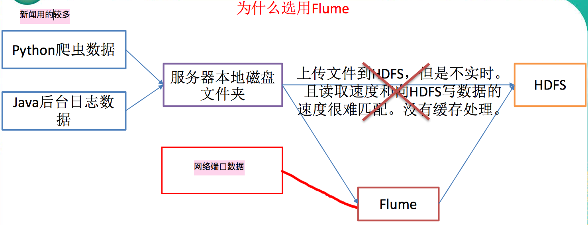

## 1. flume 简介

- Flume is a distributed, reliable, and available service for efficiently collecting, aggregating, and moving large amounts of log data.

  flume只能传文本文件

- flume最主要的作用:实时读取服务器本地磁盘的数据,将数据写入hdfs中.
- flume可以根据avro sink和avro source 形成分布式

### netcat

可以监控客户端和服务端.实现网络通信,用的是端口

 