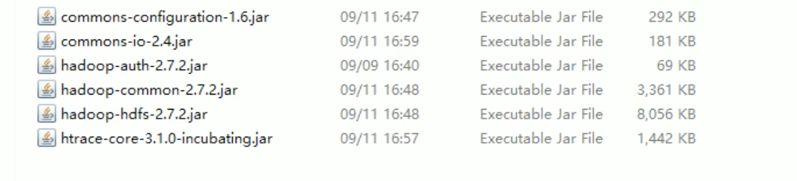

[TOC]


## 1. flume 简介

- Flume is a distributed, reliable, and available service for efficiently collecting, aggregating, and moving large amounts of log data.

  flume只能传文本文件


- flume最主要的作用:实时读取服务器本地磁盘的数据,将数据写入hdfs中.
- flume可以根据avro sink和avro source 形成分布式


### netcat

可以监控客户端和服务端.实现网络通信,用的是端口


### hdfs sink


flume从本地上传到hdfs,要在flume/lib下放hadoop的jar包



**参数配置:**

1. 


rollsize配成块大小,吧128M最后四位设置成0(保证一个文件不会大于128M)

时间一般关闭

滚动的是文件


2. 


滚动的是文件夹

```
a3.sinks.k3.hdfs.path = hdfs://hadoop102:9000/flume/upload/%Y%m%d/%H
```


3.


