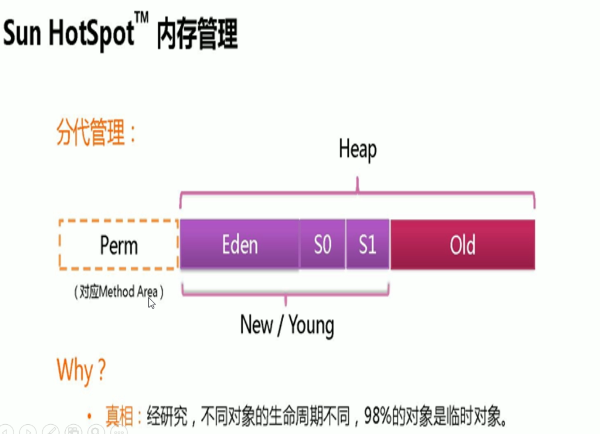
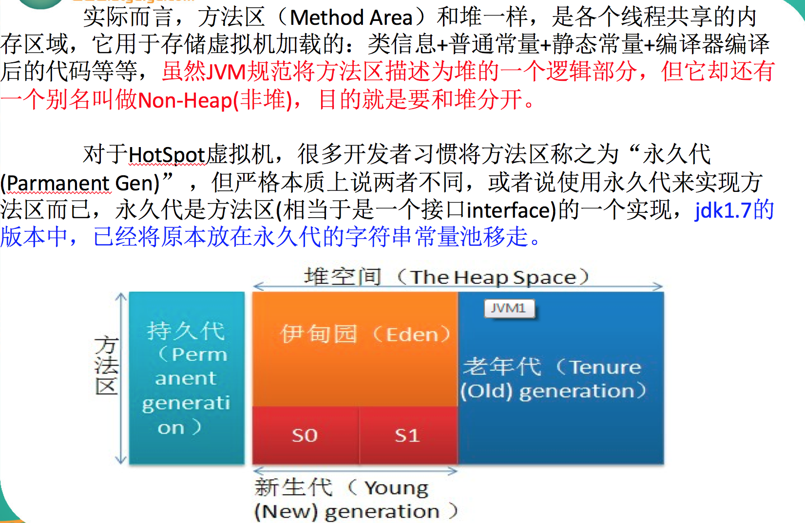
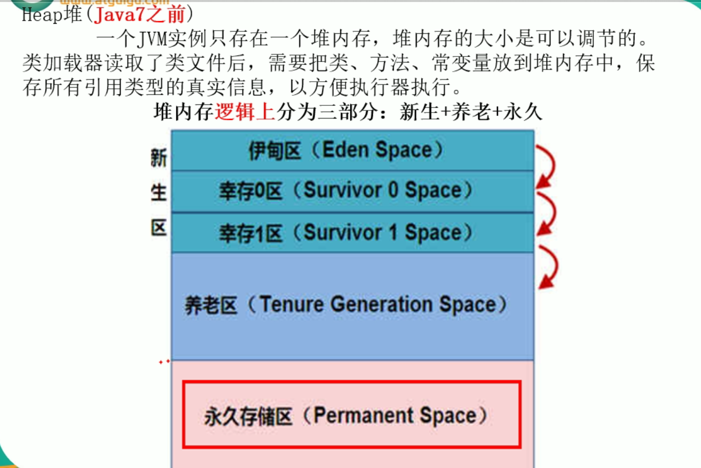

## 1.永久带

永久带是java7,元空间是8

方法区是规范,元空间是实现. 

逻辑上:新生+养老+元空间

物理上:新生+养老

永久区几乎没有垃圾回收,存放的是最基本的元素

永久区(**java7****之前有**)

  永久存储区是一个常驻内存区域，用于存放JDK自身所携带的 Class,Interface 的元数据，也就是说它存储的是运行环境必须的类信息，被装载进此区域的数据是不会被垃圾回收器回收掉的，关闭 JVM 才会释放此区域所占用的内存。