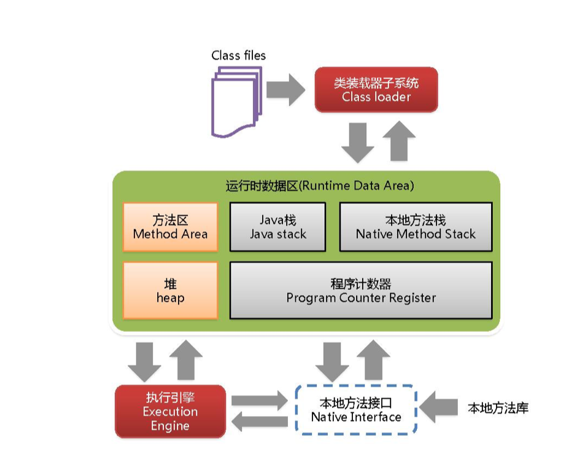
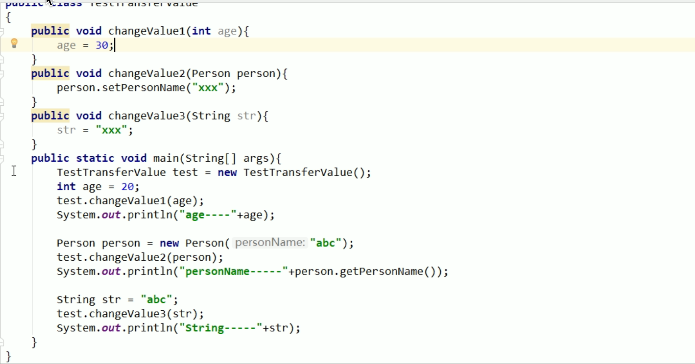

## 1.架构图



- 灰色代表线程私有,内存占的很少,几乎不存在垃圾回收

## 2.class loader


- 

- java自带的,走的是bootstrap(rt.jar)

  

- 自己编的走的是appClassLoader

- java版本不断更新,后加入的jar包用extension 类加载器  javaX的包


### 双亲委派机制

当一个类收到了类加载请求，他首先不会尝试自己去加载这个类，而是把这个请求委派给父类去完成，每一个层次类加载器都是如此，因此所有的加载请求都应该传送到启动类加载其中，**只有当父类加载器反馈自己无法完成这个请求的时候（在它的加载路径下没有找到所需加载的Class），子类加载器才会尝试自己去加载。** 


采用双亲委派的一个好处是比如加载位于 rt.jar 包中的类 java.lang.Object，不管是哪个加载器加载这个类，最终都是委托给顶层的启动类加载器进行加载，这样就保证了使用不同的类加载器最终得到的都是同样一个 Object对象。 


保证加载的String都是同一个.不污染源代码


- 


## 3.Native Method Stack

```java
public class T2 {
    public static void main(String[] args) {
        Thread t1 = new Thread();
        t1.start();
        t1.start();
    }
}

//start中:
 try {
            start0();
            started = true;
        } 

private native void start0();	//类只有方法的声明,没有实现
```

- native要调底层操作系统或c语言函数库的方法,(线程是系统级别的,不是语言级别的)

- 线程start后不是立即启动,要等待cpu和操作系统调度
- 

## 4.PC寄存器

  每个线程都有一个程序计数器，是线程私有的,就是一个指针，指向方法区中的方法字节码（**用来存储指向下一条指令的地址,也即将要执行的指令代码**），由执行引擎读取下一条指令，是一个非常小的内存空间，几乎可以忽略不记。

(类似排班值日表,火车车厢之间的钩子 )在cpu中

这块内存区域很小，**它是当前线程所执行的字节码的行号指示器**，字节码解释器通过改变这个计数器的值来选取下一条需要执行的字节码指令。


如果执行的是一个Native方法，那这个计数器是空的。(native不归java管)


用以完成分支、循环、跳转、异常处理、线程恢复等基础功能。不会发生内存溢出(OutOfMemory=OOM)错误

- 


##  5.方法区

- 存在垃圾回收,但很少.线程共享

供各线程共享的运行时内存区域。它存储了每一个**类的结构信息**，例如运行时常量池（Runtime Constant Pool）、字段和方法数据、构造函数和普通方法的字节码内容。上面讲的是规范，在不同虚拟机里头实现是不一样的，最典型的就是永久代(PermGen space)和元空间(Metaspace)。

But

**实例变量存在堆内存中,和方法区无关**


方法区:接口

永久代/元空间:实现类   (类似于格力空调)


## 6.栈

栈也叫栈内存，主管Java程序的运行，是在线程创建时创建，它的生命期是跟随线程的生命期，线程结束栈内存也就释放，**对于栈来说不存在垃圾回收问题**，只要线程一结束该栈就Over，生命周期和线程一致，是线程私有的。<font color="red">8种基本类型的变量+对象的引用变量+实例方法都是在函数的栈内存中分配。</font>


栈管运行,堆管存储


 

<font color="red">**Person p1是引用变量**</font>


方法压到栈里叫栈帧

- <font color="red">栈存储什么?</font>

  栈帧中主要保存3 类数据：

  本地变量（Local Variables）:输入参数和输出参数以及方法内的变量；

  栈操作（Operand Stack）:记录出栈、入栈的操作；

  栈帧数据（Frame Data）:包括类文件、方法等等。

  


- **stackoverflowError**


- 不是异常,是错误


## 7.堆栈方法区关系


p1 指向了new 出来的实例对象,引用同一个对象模板(存在于方法区中)


hotspot就是现在常用的jdk


## 8.堆

堆:

​	1.新生代:

​				eden区

​				幸存者0区

​				幸存者1区

​	2.老年代

​	3.元空间(java8)


### 新生区

***(******如下是首次讲解，简单版，先入门大致理解，下一页******ppt******详细******)***

  新生区是类的诞生、成长、消亡的区域，一个类在这里产生，应用，最后被垃圾回收器收集，结束生命。新生区又分为两部分： 伊甸区（Eden space）和幸存者区（Survivor pace） ，所有的类都是在伊甸区被new出来的。幸存区有两个： 0区（Survivor 0 space）和1区（Survivor 1 space）。当伊甸园的空间用完时，程序又需要创建对象，JVM的垃圾回收器将对伊甸园区进行垃圾回收(Minor GC)，将伊甸园区中的不再被其他对象所引用的对象进行销毁。然后将伊甸园中的剩余对象移动到幸存 0区。若幸存 0区也满了，再对该区进行垃圾回收，然后移动到 1 区。那如果1 区也满了呢？再移动到养老区。若养老区也满了，那么这个时候将产生MajorGC（FullGC），进行养老区的内存清理。若养老区执行了Full GC之后发现依然无法进行对象的保存，就会产生OOM异常“OutOfMemoryError”。


### OOM

如果出现java.lang.OutOfMemoryError: Java heap space异常，说明Java虚拟机的堆内存不够。原因有二：

（1）Java虚拟机的堆内存设置不够，可以通过参数-Xms、-Xmx来调整。

（2）代码中创建了大量大对象，并且长时间不能被垃圾收集器收集（存在被引用）。


**物理**上分为:新生+养老两部分


Eden满了,开启GC

​	一般说GC,就是发生在新生代的.

​	经过一次GC,绝大多数都死亡.

​	

​	幸存者0区,from区

​	s0 = from

​	s1 = to

​	交换

​	from区和to区,他们的位置和名分不是固定的,每次GC后会交换

​	GC之后有交换,谁空谁是to


old养老区,满了,开启

​	full GC=FGC

​	full GC 多次,发现养老区空间没法腾出来,

​	OOM (OutOfMemoryError)


(注意比例)


## 9. transferValue



​	结果:20  xxx    abc

​	基本类型传的是复印件 引用类型传的是内存地址

  


str在常量池,有就复用,没有就新建

