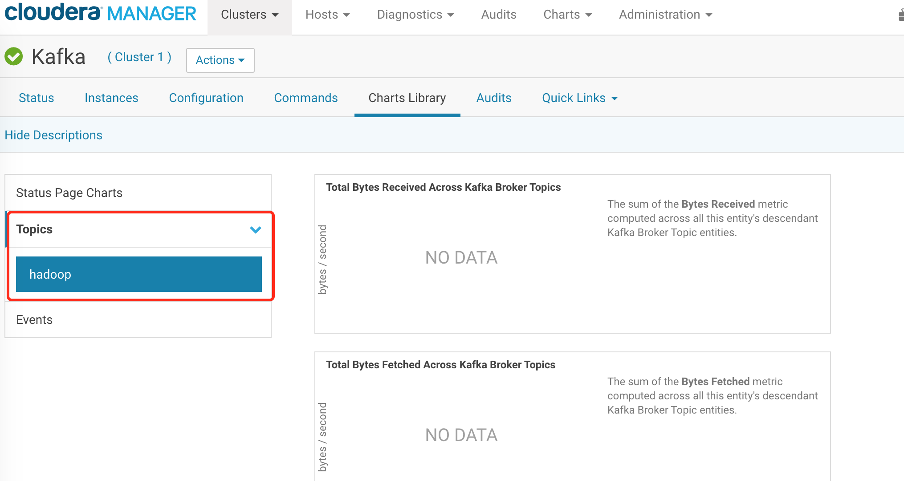
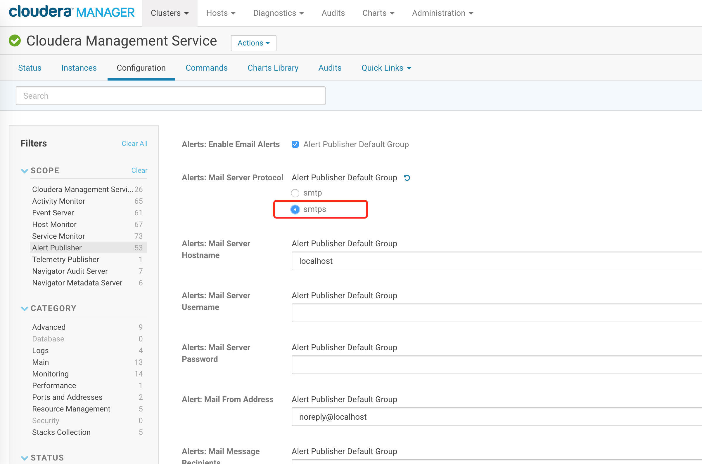

[TOC]

## 1.CDK
http://archive.cloudera.com/kafka/parcels/4.1.0/

```
[root@ruozedata001 kafka_parcel]# ll
total 85708
-rw-r--r-- 1 root root 87751486 Jul 11 22:04 KAFKA-4.1.0-1.4.1.0.p0.4-el7.parcel
-rw-r--r-- 1 root root       41 Jul 11 22:04 KAFKA-4.1.0-1.4.1.0.p0.4-el7.parcel.sha
-rw-r--r-- 1 root root     5212 Jul 11 22:04 manifest.json
```


部署流程:

https://docs.cloudera.com/documentation/kafka/latest/topics/kafka_installing.html#concept_m2t_d45_4r

```
Installing or Upgrading Kafka from a Parcel

Minimum Required Role: Cluster Administrator (also provided by Full Administrator)
配置http服务
http://47.103.134.203/kafka_parcel/

http://hadoop001/kafka_parcel/


1.In Cloudera Manager, select Hosts > Parcels.
2.If you do not see Kafka in the list of parcels, you can add the parcel to the list.
Find the parcel for the version of Kafka you want to use on CDK Powered By Apache Kafka Versions.
Copy the parcel repository link.
On the Cloudera Manager Parcels page, click Configuration.
In the field Remote Parcel Repository URLs, click + next to an existing parcel URL to add a new field.
Paste the parcel repository link.
Save your changes.
3.On the Cloudera Manager Parcels page, download the Kafka parcel, distribute the parcel to the hosts in your cluster, and then activate the parcel. See Managing Parcels. After you activate the Kafka parcel, Cloudera Manager prompts you to restart the cluster. You do not need to restart the cluster after installing Kafka. Click Close to ignore this prompt.
4.Add the Kafka service to your cluster. See Adding a Service.
```


kafka案例

```
[root@hadoop002 ~]# cd /opt/cloudera/parcels/KAFKA/lib/kafka/bin

./kafka-topics.sh \
--create \
--zookeeper hadoop001:2181,hadoop002:2181,hadoop003:2181/kafka \
--replication-factor 3 --partitions 3 --topic hadoop


```




```
#在第一个hadoop002窗口输入
./kafka-console-producer.sh \
--broker-list hadoop001:9092,hadoop002:9092,hadoop003:9092 \
--topic hadoop

#在第二个hadoop002窗口输入
./kafka-console-consumer.sh \
--bootstrap-server hadoop001:9092,hadoop002:9092,hadoop003:9092 \
--from-beginning \
--topic hadoop

#删除topic
./kafka-topics.sh  \
--delete \
--zookeeper  hadoop001:2181,hadoop002:2181,hadoop003:2181/kafka  \
--topic hadoop
```

Note: This will have no impact if delete.topic.enable is not set to true.

重启kafka,真正删除

生产上少做topic删除操作


## 2.CDS

http://archive.cloudera.com/spark2/csd/SPARK2_ON_YARN-2.4.0.cloudera2.jar
http://archive.cloudera.com/spark2/parcels/2.4.0.cloudera2/


CDS 2.2 and higher require JDK 8 only. If you are using CD 2.2 or higher, you must remove JDK 7 from all cluster and gateway hosts to ensure proper operation.


```
[root@hadoop001 spark2_parcel]# ll
total 194300
-rw-r--r-- 1 root root      5181 Apr 29 22:27 manifest.json
-rw-r--r-- 1 root root 198924405 Apr 29 22:27 SPARK2-2.4.0.cloudera2-1.cdh5.13.3.p0.1041012-el7.parcel
-rw-r--r-- 1 root root        41 Apr 29 22:27 SPARK2-2.4.0.cloudera2-1.cdh5.13.3.p0.1041012-el7.parcel.sha
-rw-r--r-- 1 root root     19066 Apr 29 22:27 SPARK2_ON_YARN-2.4.0.cloudera2.jar
[root@hadoop001 spark2_parcel]# 

http://47.103.134.203/spark2_parcel/

http://hadoop001/spark2_parcel/
```


http://47.103.134.203/spark2_parcel/

http://hadoop001/spark2_parcel/


```
spark2-submit \
--master yarn \
--num-executors 1 \
--executor-cores 1 \
--executor-memory 1G \
--class org.apache.spark.examples.SparkPi \
/opt/cloudera/parcels/SPARK2/lib/spark2/examples/jars/spark-examples_2.11-2.4.0.cloudera2.jar
```


Exception in thread "main" org.apache.hadoop.security.AccessControlException: 
Permission denied: user=root, access=WRITE, inode="/user":hdfs:supergroup:drwxr-xr-x


## 3.监控

阿里云主机



163 ==> qq  (163发送,qq邮箱接收)

