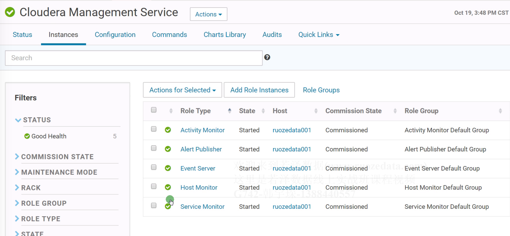
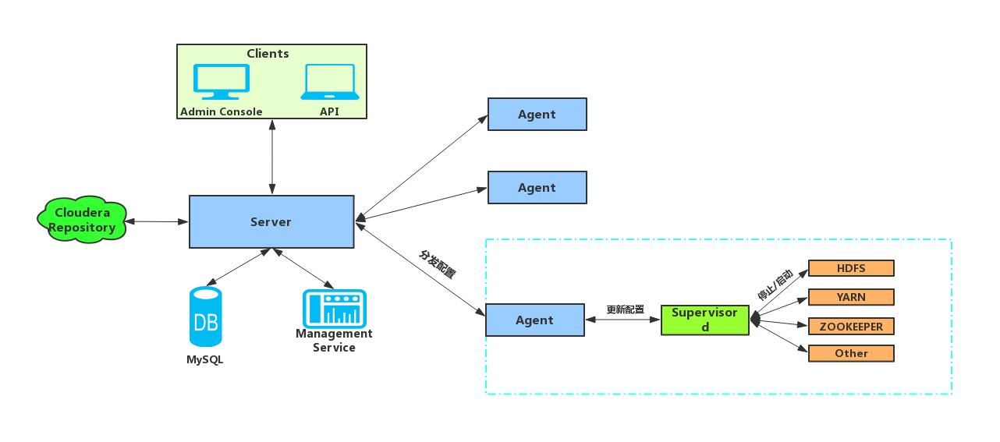
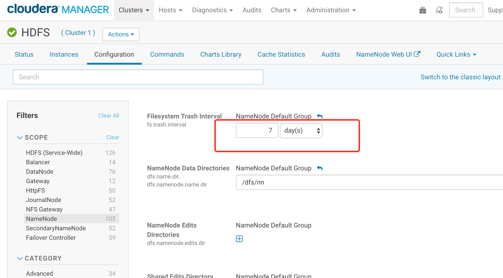
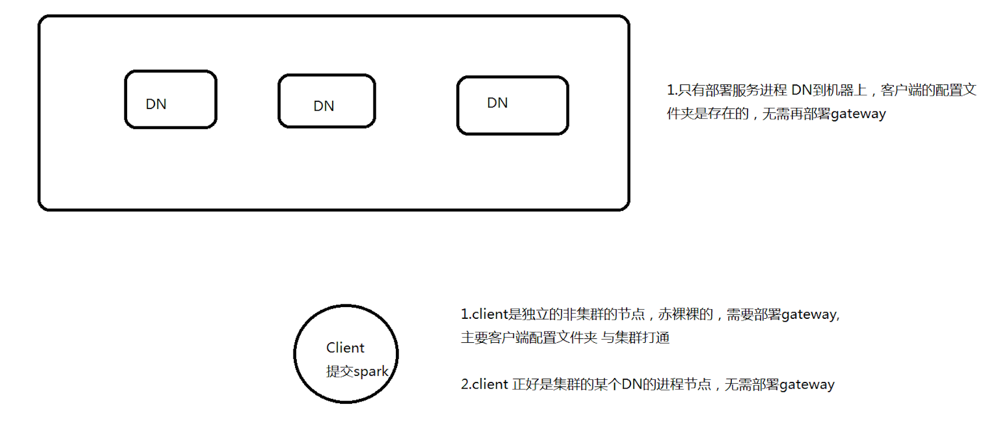
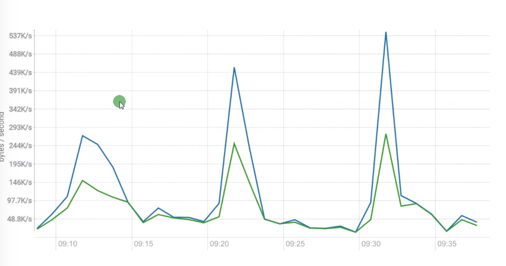

[TOC]

## 1.cloudera官网

www.cloudera.com  CM不开源  CDH: CM+apache组件和cloudera公司的组件

CDH    6.x 6.3.1   HDFS3.0 HBase2.0
    		5.x 5.16.1  HDFS2.6 HBase1.2 (推荐)


https://www.cloudera.com/downloads/manager/5-16-2.html
https://docs.cloudera.com/documentation/index.html
https://docs.cloudera.com/documentation/enterprise/5-16-x.html


## 2.正常启动停止顺序

su - mysqladmin
service mysql start

/opt/cloudera-manager/cm-5.16.1/etc/init.d/cloudera-scm-server start 1个节点
/opt/cloudera-manager/cm-5.16.1/etc/init.d/cloudera-scm-agent start 所有节点

进入web7180，先启动 CMS 5个进程服务




 启动Cluster1服务: HDFS YARN ZK KAFKA HBASE


停止顺序?


### 故障点

坑: mysql 单点 	存储的是cm metadata 

cm挂了 启动 初始化  cm metadata + hive 表数据 重新初始化


他们没有做:

1.mysql没有开启binlog
2.mysql没有 定期备份 1天 
备份 mysqldump命令    cmf >cmf.sql 


## 3.架构




假如 CM web界面server服务挂了，HDFS YARN这些服务正常吗？

正常,因为agent没挂 .server和agent只是通信状态


配置:
服务端   /opt/cloudera-manager/cm-5.16.2/run/cloudera-scm-agent/process/366-hdfs-NAMENODE

(服务端的数据必须通过web界面修改, 因为每次都会更新文件夹,366只是旧的文件夹)

客户端   /etc/hadoop/conf


在hdfs上修改一个参数



将nn的一天改为7天.充刷一下.

mysql数据库中有维护记录cmf.configs会增加一条记录


```
[root@hadoop001 process]# cd /opt/cloudera-manager/cm-5.16.1/run/cloudera-scm-agent/process
[root@hadoop001 process]# 
[root@hadoop001 process]# ls  -lrt  #按时间排序
total 0
drwxr-x--x 3 cloudera-scm cloudera-scm 340 Feb  2 10:24 40-cloudera-mgmt-ACTIVITYMONITOR
drwxr-x--x 3 cloudera-scm cloudera-scm 280 Feb  2 10:24 39-cloudera-mgmt-ALERTPUBLISHER
drwxr-x--x 3 cloudera-scm cloudera-scm 300 Feb  2 10:24 38-cloudera-mgmt-EVENTSERVER
drwxr-x--x 3 cloudera-scm cloudera-scm 320 Feb  2 10:25 41-cloudera-mgmt-HOSTMONITOR
drwxr-x--x 3 cloudera-scm cloudera-scm 380 Feb  2 10:25 37-cloudera-mgmt-SERVICEMONITOR
drwxr-x--x 3 zookeeper    zookeeper    320 Feb  2 10:25 44-zookeeper-server
drwxr-x--x 3 hdfs         hdfs         540 Feb  2 10:47 50-hdfs-NAMENODE-nnRpcWait
drwxr-x--x 3 hdfs         hdfs         520 Feb  2 10:47 49-hdfs-NAMENODE
drwxr-x--x 3 hdfs         hdfs         420 Feb  2 10:47 46-hdfs-DATANODE
drwxr-x--x 3 hdfs         hdfs         400 Feb  2 10:47 45-hdfs-SECONDARYNAMENODE
drwxr-x--x 3 hdfs         hdfs         380 Feb  2 10:47 56-hdfs-SECONDARYNAMENODE
drwxr-x--x 3 hdfs         hdfs         400 Feb  2 10:47 57-hdfs-DATANODE
drwxr-x--x 3 hdfs         hdfs         500 Feb  2 10:47 60-hdfs-NAMENODE
drwxr-x--x 3 hdfs         hdfs         520 Feb  2 10:48 61-hdfs-NAMENODE-nnRpcWait
drwxr-x--x 3 yarn         hadoop       560 Feb  2 10:48 55-yarn-RESOURCEMANAGER
drwxr-x--x 3 yarn         hadoop       500 Feb  2 10:48 51-yarn-NODEMANAGER
drwxr-x--x 3 yarn         hadoop       540 Feb  2 10:48 66-yarn-RESOURCEMANAGER
drwxr-x--x 3 yarn         hadoop       500 Feb  2 10:48 62-yarn-NODEMANAGER
drwxr-xr-x 4 root         root         100 Feb  2 10:48 ccdeploy_hadoop-conf_etchadoopconf.cloudera.yarn_-8611871389345466776
drwxr-xr-x 4 root         root         100 Feb  2 10:48 ccdeploy_hadoop-conf_etchadoopconf.cloudera.hdfs_-48353194737215520
[root@hadoop001 process]# 
[root@hadoop001 process]# cd 61-hdfs-NAMENODE-nnRpcWait
[root@hadoop001 61-hdfs-NAMENODE-nnRpcWait]# ll
total 76
-rwxr----- 1 hdfs hdfs 2149 Feb  2 10:48 cloudera_manager_agent_fencer.py
-rw-r----- 1 hdfs hdfs    0 Feb  2 10:48 cloudera_manager_agent_fencer_secret_key.txt
-rw-r----- 1 hdfs hdfs  360 Feb  2 10:48 cloudera-monitor.properties
-rw-r----- 1 hdfs hdfs  322 Feb  2 10:48 cloudera-stack-monitor.properties
-rw------- 1 root root 8315 Feb  2 10:48 config.zip
-rw-r----- 1 hdfs hdfs 3781 Feb  2 10:48 core-site.xml
-rw-r----- 1 hdfs hdfs  194 Feb  2 10:48 dfs_all_hosts.txt
-rw-r----- 1 hdfs hdfs 1388 Feb  2 10:48 event-filter-rules.json
-rw-r--r-- 1 hdfs hdfs    0 Feb  2 10:48 exit_code
-rw-r----- 1 hdfs hdfs    0 Feb  2 10:48 hadoop-metrics2.properties
-rw-r----- 1 hdfs hdfs   98 Feb  2 10:48 hadoop-policy.xml
-rw------- 1 hdfs hdfs    0 Feb  2 10:48 hdfs.keytab
-rw-r----- 1 hdfs hdfs 5616 Feb  2 10:48 hdfs-site.xml
-rw-r----- 1 hdfs hdfs    0 Feb  2 10:48 http-auth-signature-secret
-rw-r----- 1 hdfs hdfs 3225 Feb  2 10:48 log4j.properties
drwxr-x--x 2 hdfs hdfs   80 Feb  2 10:48 logs
-rw-r----- 1 hdfs hdfs    0 Feb  2 10:48 navigator.client.properties
-rw------- 1 root root 1373 Feb  2 10:48 proc.json
-rw-r----- 1 hdfs hdfs    0 Feb  2 10:48 redaction-rules.json
-rw-r----- 1 hdfs hdfs  315 Feb  2 10:48 ssl-client.xml
-rw-r----- 1 hdfs hdfs   98 Feb  2 10:48 ssl-server.xml
-rw------- 1 root root 4012 Feb  2 10:48 supervisor.conf
-rw-r----- 1 hdfs hdfs  377 Feb  2 10:48 topology.map
-rwxr----- 1 hdfs hdfs 1667 Feb  2 10:48 topology.py

[root@hadoop001 61-hdfs-NAMENODE-nnRpcWait]# cat core-site.xml 
  <property>
    <name>fs.trash.interval</name>
    <value>10080</value>
  </property>
```


修改 顺序:


1.cmf.config表
2.服务端 带序号的
3.客户端 不带序号 默认的

务必从web界面修改参数值 


应用开发 配置 /etc/hadoop/conf

客户端  有种叫法: gateway(就是这个路径 /etc/hadoop/conf)    不需要重启服务.





## 4.日志
http://106.14.180.252:7180/cmf/config2?task=ALL_LOG_DIRECTORIES


组件服务的日志： /var/log/xxx

cm的日志:

**TAR** CM的 /opt/cloudera-manager/cm-5.16.1/log/cloudera-scm-server
     /opt/cloudera-manager/cm-5.16.1/log/cloudera-scm-agent

**RPM**部署CM ：/var/log/cloudera-scm-server 
            /var/log/cloudera-scm-agent

 

xxxxx..log.out  进程的日志  出现error  优先排查
Will not attempt to authenticate using SASL (unknown error)

xxxx.stdout     stdout和stderror一样.只是stderror是debug模式
xxxx.stderr

http://blog.itpub.net/30089851/viewspace-2136372/


## 5.界面解读

进程 process  (cdh中叫)  instance  role    这三个都是一样的 


NameNode Advanced Configuration Snippet (Safety Valve) for hdfs-site.xml  配置cdh没有提供的额外参数

ranger HDP


## 6.添加服务&HOST

先手工的部署agent 启动/opt/cloudera-manager/cm-5.16.2/etc/init.d/cloudera-scm-agent start


##7.监控
TS query language  TSQL

生产者
SELECT total_kafka_bytes_received_rate_across_kafka_broker_topics 
WHERE entityName = "kafka:DSHS" AND category = KAFKA_TOPIC

消费者
SELECT total_kafka_bytes_fetched_rate_across_kafka_broker_topics 
WHERE entityName = "kafka:DSHS" AND category = KAFKA_TOPIC

SELECT 
total_kafka_bytes_received_rate_across_kafka_broker_topics,
total_kafka_bytes_fetched_rate_across_kafka_broker_topics 
WHERE entityName = "kafka:DSHS" AND category = KAFKA_TOPIC


kafka的图:

