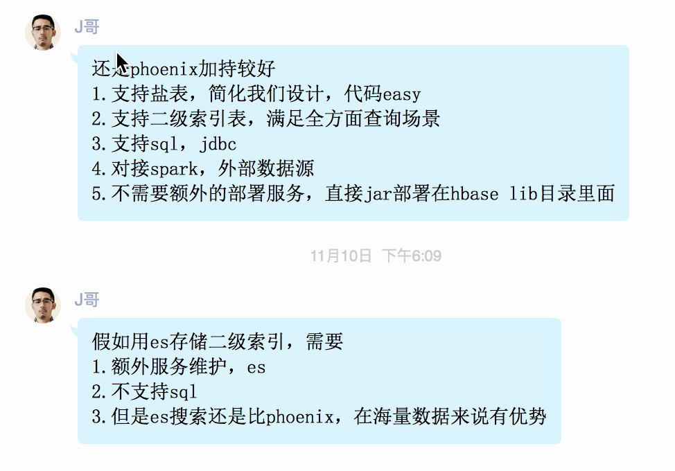

## note

有一些公司技术选型 不敢用 

​	因为要对hbase理解要深,不能简简单单会对hbase部署,调用api.

​	数据量大的会发生问题


---



---


```shell
#只需要修改zoo.cfg的dataDir
[hadoop@ruozedata000 zookeeper]$ cd conf
[hadoop@ruozedata000 conf]$ ll
total 12
-rw-rw-r--. 1 hadoop hadoop  535 Aug 10  2018 configuration.xsl
-rw-rw-r--. 1 hadoop hadoop 2693 Aug 10  2018 log4j.properties
-rw-rw-r--. 1 hadoop hadoop  922 Aug 10  2018 zoo_sample.cfg
[hadoop@ruozedata000 conf]$ 
[hadoop@ruozedata000 conf]$ cp zoo_sample.cfg zoo.cfg
[hadoop@ruozedata000 conf]$ ll
total 16
-rw-rw-r--. 1 hadoop hadoop  535 Aug 10  2018 configuration.xsl
-rw-rw-r--. 1 hadoop hadoop 2693 Aug 10  2018 log4j.properties
-rw-rw-r--. 1 hadoop hadoop  922 Dec 31 19:42 zoo.cfg
-rw-rw-r--. 1 hadoop hadoop  922 Aug 10  2018 zoo_sample.cfg
[hadoop@ruozedata000 conf]$ 
[hadoop@ruozedata000 conf]$ vi zoo.cfg 
# The number of milliseconds of each tick
tickTime=2000
# The number of ticks that the initial
# synchronization phase can take
initLimit=10
# The number of ticks that can pass between
# sending a request and getting an acknowledgement
syncLimit=5
# the directory where the snapshot is stored.
# do not use /tmp for storage, /tmp here is just
# example sakes.
dataDir=/home/hadoop/app/zookeeper
# the port at which the clients will connect
clientPort=2181
# the maximum number of client connections.
# increase this if you need to handle more clients
#maxClientCnxns=60


#启动zk
[hadoop@ruozedata000 zookeeper]$ bin/zkServer.sh  start
JMX enabled by default
Using config: /home/hadoop/app/zookeeper/bin/../conf/zoo.cfg
Starting zookeeper ... STARTED
[hadoop@ruozedata000 zookeeper]$ jps
6053 Jps
6024 QuorumPeerMain
[hadoop@ruozedata000 zookeeper]$ bin/zkServer.sh  status
JMX enabled by default
Using config: /home/hadoop/app/zookeeper/bin/../conf/zoo.cfg
Mode: standalone
```


```shell
#启动hbse
[hadoop@ruozedata000 bin]$ hbase shell 


hbase(main):007:0* create_namespace 'ruozedata'
0 row(s) in 0.4230 seconds

hbase(main):008:0> create 'ruozedata:orderinfo','SKU','ORDER'
0 row(s) in 2.4080 seconds

=> Hbase::Table - ruozedata:orderinfo
hbase(main):009:0> describe 'ruozedata:orderinfo'
Table ruozedata:orderinfo is ENABLED                                                         
ruozedata:orderinfo                                                                          
COLUMN FAMILIES DESCRIPTION                                                                  
{NAME => 'ORDER', BLOOMFILTER => 'ROW', VERSIONS => '1', IN_MEMORY => 'false', KEEP_DELETED_C
ELLS => 'FALSE', DATA_BLOCK_ENCODING => 'NONE', TTL => 'FOREVER', COMPRESSION => 'NONE', MIN_
VERSIONS => '0', BLOCKCACHE => 'true', BLOCKSIZE => '65536', REPLICATION_SCOPE => '0'}       
{NAME => 'SKU', BLOOMFILTER => 'ROW', VERSIONS => '1', IN_MEMORY => 'false', KEEP_DELETED_CEL
LS => 'FALSE', DATA_BLOCK_ENCODING => 'NONE', TTL => 'FOREVER', COMPRESSION => 'NONE', MIN_VE
RSIONS => '0', BLOCKCACHE => 'true', BLOCKSIZE => '65536', REPLICATION_SCOPE => '0'}         
2 row(s) in 0.1770 seconds


#插入数据
hbase(main):010:0>   put 'ruozedata:orderinfo','row1','SKU:SKUName','红心火龙果'
0 row(s) in 0.1940 seconds

hbase(main):011:0> scan 'ruozedata:orderinfo'
ROW                      COLUMN+CELL                                                         
 row1                    column=SKU:SKUName, timestamp=1577812839670, value=\xE7\xBA\xA2\xE5\
                         xBF\x83\xE7\x81\xAB\xE9\xBE\x99\xE6\x9E\x9C                         
1 row(s) in 0.0400 seconds


hbase(main):015:0> put 'ruozedata:orderinfo','row3','SKU:SKUName','樱桃'
0 row(s) in 0.0110 seconds

hbase(main):016:0> get 'ruozedata:orderinfo','row3'
COLUMN                   CELL                                                                
 SKU:SKUName             timestamp=1577813070315, value=\xE6\xA8\xB1\xE6\xA1\x83             
1 row(s) in 0.0130 seconds


hbase(main):017:0> delete 'ruozedata:orderinfo','row2'
0 row(s) in 0.0620 seconds

hbase(main):018:0> scan 'ruozedata:orderinfo'
ROW                      COLUMN+CELL                                                         
 row1                    column=SKU:SKUName, timestamp=1577812987052, value=\xE7\x99\xBD\xE5\
                         xBF\x83\xE7\x81\xAB\xE9\xBE\x99\xE6\x9E\x9C                         
 row3                    column=SKU:SKUName, timestamp=1577813070315, value=\xE6\xA8\xB1\xE6\
                         xA1\x83                                                             
2 row(s) in 0.0120 seconds


#drop
hbase(main):019:0> drop 'ruozedata:orderinfo'

ERROR: Table ruozedata:orderinfo is enabled. Disable it first.

Drop the named table. Table must first be disabled:
  hbase> drop 't1'
  hbase> drop 'ns1:t1'


hbase(main):020:0> list
TABLE                                                                                        
ruozedata:orderinfo                                                                          
1 row(s) in 0.0350 seconds

=> ["ruozedata:orderinfo"]
hbase(main):021:0> disable 'ruozedata:orderinfo'
0 row(s) in 2.2990 seconds

hbase(main):022:0> drop 'ruozedata:orderinfo'
0 row(s) in 1.2980 seconds

hbase(main):023:0> list
TABLE                                                                                        
0 row(s) in 0.0080 seconds

=> []


#多版本
hbase(main):024:0> create 'ruoze','user'
0 row(s) in 1.2230 seconds

=> Hbase::Table - ruoze
hbase(main):025:0> describe 'ruoze'
Table ruoze is ENABLED                                                                       
ruoze                                                                                        
COLUMN FAMILIES DESCRIPTION                                                                  
{NAME => 'user', BLOOMFILTER => 'ROW', VERSIONS => '1', IN_MEMORY => 'false', KEEP_DELETED_CE
LLS => 'FALSE', DATA_BLOCK_ENCODING => 'NONE', TTL => 'FOREVER', COMPRESSION => 'NONE', MIN_V
ERSIONS => '0', BLOCKCACHE => 'true', BLOCKSIZE => '65536', REPLICATION_SCOPE => '0'}        
1 row(s) in 0.0270 seconds

hbase(main):026:0> alter 'ruoze',{NAME => 'user', VERSIONS => '3'}
Updating all regions with the new schema...
1/1 regions updated.
Done.
0 row(s) in 1.9910 seconds

hbase(main):027:0> describe 'ruoze'
Table ruoze is ENABLED                                                                       
ruoze                                                                                        
COLUMN FAMILIES DESCRIPTION                                                                  
{NAME => 'user', BLOOMFILTER => 'ROW', VERSIONS => '3', IN_MEMORY => 'false', KEEP_DELETED_CE
LLS => 'FALSE', DATA_BLOCK_ENCODING => 'NONE', TTL => 'FOREVER', COMPRESSION => 'NONE', MIN_V
ERSIONS => '0', BLOCKCACHE => 'true', BLOCKSIZE => '65536', REPLICATION_SCOPE => '0'}        
1 row(s) in 0.0390 seconds


#查看多版本

hbase(main):028:0> put 'ruoze','row1','user:name','ruoze1'
0 row(s) in 0.0160 seconds

hbase(main):029:0> put 'ruoze','row1','user:name','ruoze2'
0 row(s) in 0.0120 seconds

hbase(main):030:0> put 'ruoze','row1','user:name','ruoze3'
0 row(s) in 0.0150 seconds

hbase(main):031:0> scan 'ruoze', {RAW => true, VERSIONS => 3}
ROW                      COLUMN+CELL                                                         
 row1                    column=user:name, timestamp=1577813759870, value=ruoze3             
 row1                    column=user:name, timestamp=1577813755250, value=ruoze2             
 row1                    column=user:name, timestamp=1577813749865, value=ruoze1             
1 row(s) in 0.0190 seconds


```

