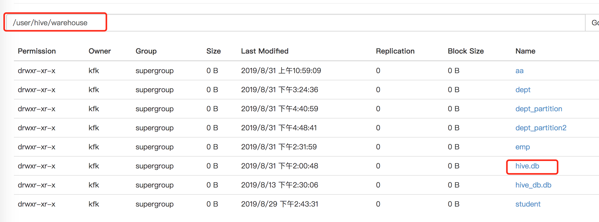
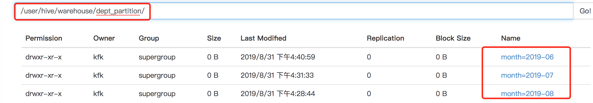
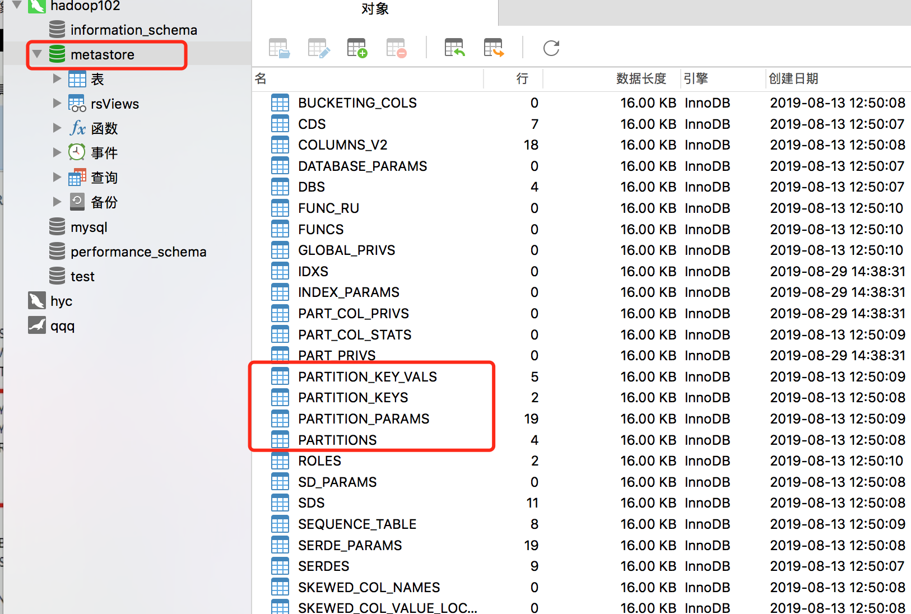
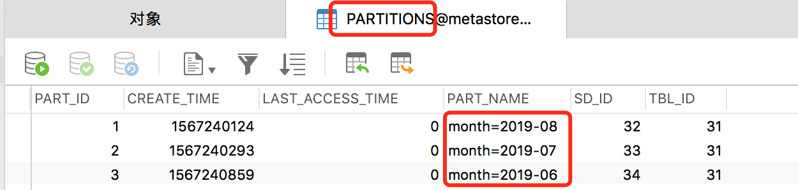

[TOC]

## hive重点关注

1. **基础**
           内外部表区别
           UDF？
           rlike

   ​		hive索引问题

2. **进阶**
           窗口  topn  ...
           调优     小文件？
           SQL执行流程
           分区表  分桶表  分别能带来什么好处\

   

---

## 个人理解

1. hive读多写少,要查找某个特定的值,需要全表扫描,延迟较高.与mysql相比不适合在线查询

2. hive中再开启一个客户端,会报异常.原因是metastore 默认存储在自带的derby数据库中.因此使用mysql来存储metastore信息.

3. 配置完metastore到mysql(修改hive-site.xml),mysql增加了metastore数据库

4. hive数据仓库原始位置是在 hdfs上 /user/hive/warehouse路径下

   

5. 分区表例如按时间分区,可以避免全表扫描


---

## 一 Hive常用交互命令


### 1.执行文件中的 sql 语句并将结果写入文件中

```
[atguigu@hadoop102 hive]$
bin/hive -f
/opt/module/datas/hivef.sql
>
/opt/module/datas/hive_result.txt
```


### 2.在 hive cli 命令窗口中如何查看 hdfs 文件系统

```
hive> dfs -ls /;
```


### 3.“-e”不进入 hive 的交互窗口执行 sql 语句

```
[atguigu@hadoop102 hive]$ bin/hive -e "select id from student;"
```

---

## 二 表

### 1. 内外部表

#### desc formatted dept;

查看表的详细信息

```shell
hive (default)> desc formatted dept;
OK
col_name        data_type       comment
# col_name              data_type               comment             
                 
deptno                  int                                         
dname                   string                                      
loc                     int                                         
                 
# Detailed Table Information             
Database:               default                  
Owner:                  kfk                      
CreateTime:             Sat Aug 31 15:24:21 CST 2019     
LastAccessTime:         UNKNOWN                  
Protect Mode:           None                     
Retention:              0                        
Location:               hdfs://hadoop102:9000/user/hive/warehouse/dept   
Table Type:             EXTERNAL_TABLE           
Table Parameters:                
        COLUMN_STATS_ACCURATE   true                
        EXTERNAL                TRUE                
        numFiles                1                   
        totalSize               68                  
        transient_lastDdlTime   1567236276          
                 
# Storage Information            
SerDe Library:          org.apache.hadoop.hive.serde2.lazy.LazySimpleSerDe       
InputFormat:            org.apache.hadoop.mapred.TextInputFormat         
OutputFormat:           org.apache.hadoop.hive.ql.io.HiveIgnoreKeyTextOutputFormat       
Compressed:             No                       
Num Buckets:            -1                       
Bucket Columns:         []                       
Sort Columns:           []                       
Storage Desc Params:             
        field.delim             ,                   
        serialization.format    ,                   
Time taken: 0.182 seconds, Fetched: 33 row(s)
```

- 重点看(外部表类型): 

  ```
  Table Type:             EXTERNAL_TABLE  
  ```

- 可以将外部表改为内部表:

  EXTERNAL'='FALSE 一定要大写,不然仅仅只能增加一条属性

```
hive (default)> alter table dept set tblproperties('EXTERNAL'='FALSE');
OK
Time taken: 0.164 seconds
```

- 内部表类型

```
hive (default)> desc formatted dept;
Table Type:             MANAGED_TABLE 
```


### 2.分区表

分区表实际上就是对应一个 HDFS 文件系统上的独立的文件夹，该文件夹下是该分区 所有的数据文件。Hive 中的分区就是分目录，把一个大的数据集根据业务需要分割成小的 数据集。在查询时通过 WHERE 子句中的表达式选择查询所需要的指定的分区，这样的查 询效率会提高很多。


- 分区表例如按时间分区,可以避免全表扫描(在where子句中,加入了分区的限定)

- 分区表分区的其实是文件夹

  ```shell
  hive (default)> create table dept_partition(
  deptno int, dname string, loc string
  )
  partitioned by (month string)
  row format delimited fields terminated by '\t';
  ```

  ```
  hive (default)> load data local inpath '/opt/module/datas/dept.txt' into table default.dept_partition partition(month='201709');
  ```

- 分区表可以全部查到各个分区的信息

  

- ```shell
  hive (default)> select * from dept_partition;
  OK
  dept_partition.deptno   dept_partition.dname    dept_partition.loc      dept_partition.month
  10      ACCOUNTING      1700    2019-07
  20      RESEARCH        1800    2019-07
  30      SALES   1900    2019-07
  40      OPERATIONS      1700    2019-07
  10      ACCOUNTING      1700    2019-08
  20      RESEARCH        1800    2019-08
  30      SALES   1900    2019-08
  40      OPERATIONS      1700    2019-08
  Time taken: 0.388 seconds, Fetched: 8 row(s)
  ```
  
  
  

**分区字段也是字段,特殊的字段.并不是放在实际数据中,是放在文件夹中**

 **使用分区字段(where)可以避免全表扫描.分区信息属于元数据信息**




字段实际存储在表 partition中




先访问元数据库mysql,走**where**时候,where限定的是month,分区信息,定位到一个文件夹,其他文件夹不会去访问. 在未访问hdfs之前,已经知道要访问哪个目录.比真正的数据先访问.

### 3.hive访问数据

两个前提:

1.hdfs上有数据

2.元数据信息要有 不管先后


