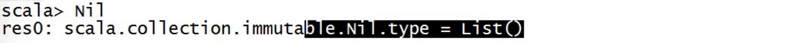
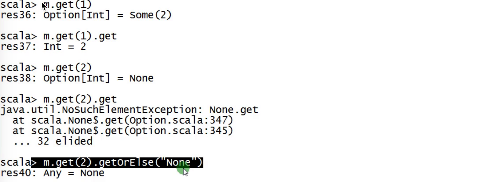

## 1. String 

```scala
object StringApp {

  def main(args: Array[String]): Unit = {

    val greeting = "Hello:Ruozedata...."
    println(greeting)

    val name = "若泽数据"
    val welcome = "Hello:" + name
    println(welcome)

    // String interpolation
    println(s"Hello:$name")

    val msg =
      """
        |这是一个多行字符串
        |hello
        |若泽数据
      """.stripMargin
    println(msg)

  }
}
```

## 2.List

- nil    空的集合

  

- 变长转定长 

  .toList    .toArray

```scala
object ListApp {

  def main(args: Array[String]): Unit = {
    val l = List(1,2,3,4,5)

    val l2 = 1 :: Nil
    val i = 1

    // 递归实现求和
    def sum(nums:Int*):Int  = {
      if(nums.length == 0) 0
      else nums.head + sum(nums.tail:_*)
    }

    println(sum(1,2,3,4,5,6))
  }

  val names = List("CXK","苏大强","谢广坤")
  val scores = List(5, 9, 4)

  val results: List[(String, Int)] = names.zip(scores) //将name和score关联起来
  val tmp: List[(((String, Int), Int), Int)] = results.zipWithIndex.zipWithIndex

  /**
    * List里面的数据结构：(((String, Int), Int), Int)
    */
  println(tmp(3)._1._1._1)

}
```

## 3.Map

```scala
object MapApp {

  def main(args: Array[String]): Unit = {
    val map = Map("longlaoshi" -> 27, "canlaoshi" -> 36, "bolaoshi" -> 31, "jepson" -> 18)

    for((k,_) <- map) {
      //println(k + " - > " + v)
      //println(k + "-->" + map.getOrElse(k, -99)) //getOrElse 取得到就取,取不到拿默认值

    }

    for(k <- map.keySet) {
      //println(k + "-->" + map.getOrElse(k, -99))
    }

    for(v <- map.values) {
      //println(v)
    }


    //scala.collection.immutable.SortedMap  //可以排序
    //scala.collection.mutable.LinkedHashMap

    /**
      * Option: Some  None 两个子类
      */

  }
}
```



## 4.case class

```scala
/**
  *
  * case class 样例类  必须要有参数列表
  * case object 样例对象  必须不能加参数列表
  *
  * interview： class 和 case class的区别
  *
  * case class 重写了toString， equals  hashCode
  * case class 默认就实现了序列化
  * case class 不用new
  *
  *
  * Trait 特质 类似于理解 Java 的Interface
  */
object CaseClassApp {
  def main(args: Array[String]): Unit = {
    println(Dog("旺财").name)
  }

}

case class Dog(name:String)
```

```
  case class 样例类  必须要有参数列表
  case object 样例对象  必须不能加参数列表
```
- class 和 case class的区别


```
case class 重写了toString， equals  hashCode
case class 默认就实现了序列化
case class 不用new
```

## 5.模式匹配

```scala
/**
  * 讲师：PK哥
  *
  * 模式匹配
  * 身高
  * 腿
  * 脸
  * 胸
  *
  *  变量  match {
  *     case 颜值 => code
  *     case 腿  => code
  *     case 身高 => code
  *     case 脸   =>  code
  *     case _  => 凤姐 芙蓉姐姐
  *  }
  *
  * 匹配内容、匹配类型、匹配集合、匹配case
  */
object MatchApp {

  def main(args: Array[String]): Unit = {

    /**
      * 匹配内容
      */

    val teachers = Array("Aoi Sola", "YuiHatano", "Akiho Yoshizawa")
    val name = teachers(Random.nextInt(teachers.length))

    name match {
      case "YuiHatano" => println("波老师")
      case "Akiho Yoshizawa" => println("吉老师")
      case _ => println("真不知道这位老师是谁")
    }

//    println(name)

    /**
      * 类型匹配
      */

    def matchType(obj:Any) = obj match {
      case x:Int => println("Int")
      case s:String => println("String")
      case m:Map[_,_] => println("Map")
      case _ => println("Other Type...")
    }

//    matchType(1)
//    matchType("若泽")
//    matchType(Map("ruoze"->30))
//    matchType(10L)

    /**
      * 匹配集合
      */
    def matchList(list:List[String]): Unit = {
      list match {
        case "ruoze"::Nil => println("Hello: ruoze") // 只能匹配只有若泽一个元素
        case x::y::Nil => println(s"Hi: $x , $y") // 能匹配集合中有两个元素的
        case "jepson"::tail => println("HI:jepson and others") // 匹配jepson开头的
        case _ => println("......")
      }
    }

//    matchList(List("ruoze"))
//    matchList(List("苍老师","泷老师"))
//    matchList(List("jepson","苍老师","泷老师","波老师"))
//    matchList(List("苍老师","泷老师","波老师","jepson"))


    /**
      * case class匹配
      */
    val caseclasses = Array(CheckTimeOutTask,HeartBeat(3000),SubmitTask("100","task100"))

    caseclasses(Random.nextInt(caseclasses.length)) match {
      case CheckTimeOutTask => println("CheckTimeOutTask")
      case HeartBeat(time) => println("HeartBeat")
      case SubmitTask(id,name) => println("SubmitTask")
    }


    val file = "xx.txt"
    try{
      //TODO... 业务逻辑处理
      // open file
      1/0
    } catch {
      case e:ArithmeticException => println("除数不能为0...")
      case e:Exception => e.printStackTrace()
    } finally {
      // 资源释放的
      // close
      println("一定会执行....")
    }
  }
}

case class SubmitTask(id:String,name:String)
case class HeartBeat(time:Long)
case object CheckTimeOutTask
```

## 6.柯里化

```scala
// currying
def sum(a:Int,b:Int) = a + b

//println(sum(3,5))

// Spark源码  Spark SQL UDF
def sum2(a:Int)(b:Int) = a + b
//println(sum2(4)(6))
```

## 7.偏函数

```scala
/**
  * 偏函数  PartialFunction
  * A: 输入参数类型
  * B：输出参数类型
  *
  * 包在花括号内没有match的一组case语句
  */
val teachers = Array("Aoi Sola", "YuiHatano", "Akiho Yoshizawa")
val name = teachers(Random.nextInt(teachers.length))


def say:PartialFunction[String,String] = {
  case "YuiHatano" => "波老师"
  case "Akiho Yoshizawa" => "吉老师"
  case _ => "真不知道这位老师是谁"
}

println(say(name))
```

## 8.读文件

```scala
object FileApp {
  def main(args: Array[String]): Unit = {
    val content = Source.fromFile("E:\\ruozedata_workspace\\ruozedata-spark\\data\\file.txt")
//    println(content)

    def read(): Unit ={
      for(line <- content.getLines()){
        println(line)
      }
    }
    read()
  }
}
```

