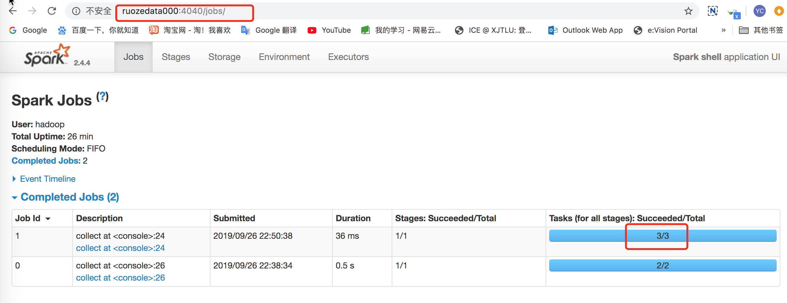

## spark1 笔记

- [spark官网链接]: http://spark.apache.org/docs/latest/rdd-programming-guide.html

  

### 1.Rdd创建方式

```shell
scala> val rdd = sc.parallelize(List(1,2,3,4,5,6),3).collect()
rdd: Array[Int] = Array(1, 2, 3, 4, 5, 6)
```




### 2.RDD操作

​    1.transformation  转换    它不会立即执行  你写了1亿个转换  白写   lazy

​    2.action          动作    只有遇到action才会提交作业开始执行      eager

```
scala> val rdd = sc.parallelize(List(1,2,3,4,5))
rdd: org.apache.spark.rdd.RDD[Int] = ParallelCollectionRDD[2] at parallelize at <console>:24

scala> val rdd1 = rdd.map(_*2)
rdd1: org.apache.spark.rdd.RDD[Int] = MapPartitionsRDD[4] at map at <console>:25

scala> rdd1.collect()
res2: Array[Int] = Array(2, 4, 6, 8, 10)
```

- 前两步都没有作业,只有到第三步触发action动作,才有作业

   

