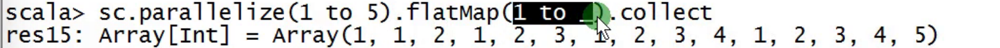
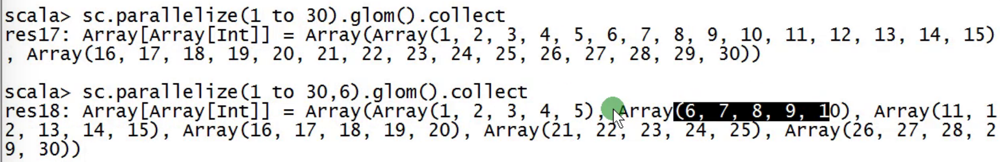
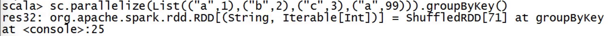
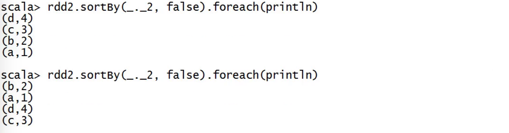
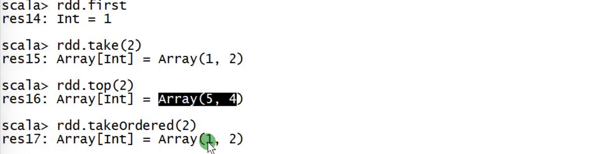
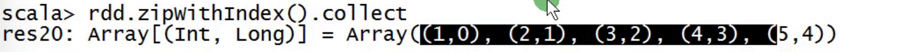

## spark01 笔记

- [spark官网链接]: http://spark.apache.org/docs/latest/rdd-programming-guide.html

  

## 1.Rdd创建方式

```shell
scala> val rdd = sc.parallelize(List(1,2,3,4,5,6),3).collect()
rdd: Array[Int] = Array(1, 2, 3, 4, 5, 6)
```


- 创建流程

```scala
object RDDApp1 {

  //master url:决定作业运行在什么模式下
  
  def main(args: Array[String]): Unit = {

    //step1:sparkconf
    val sparkConf = new SparkConf().setMaster("local[2]").setAppName("RDDApp1")

    //step2:sparkconf
    val sc = new SparkContext(sparkConf)

    //step3:处理业务逻辑
    val rdd = sc.parallelize(List(1,2,3,4,5,6),3)
    rdd.collect().foreach(println)

    //step4:关闭SparkContext
    sc.stop()
  }
}
```

## 2.RDD操作

​    1.transformation  转换    它不会立即执行  你写了1亿个转换  白写   lazy

​    2.action          动作    只有遇到action才会提交作业开始执行      eager

```
scala> val rdd = sc.parallelize(List(1,2,3,4,5))
rdd: org.apache.spark.rdd.RDD[Int] = ParallelCollectionRDD[2] at parallelize at <console>:24

scala> val rdd1 = rdd.map(_*2)
rdd1: org.apache.spark.rdd.RDD[Int] = MapPartitionsRDD[4] at map at <console>:25

scala> rdd1.collect()
res2: Array[Int] = Array(2, 4, 6, 8, 10)
```

- 前两步都没有作业,只有到第三步触发action动作,才有作业


## 3. mapValues

- key不变,只变value

```scala
// mapValues 是针对RDD[K,V]的V做处理,key不变,只变value
sc.parallelize(List(("ruoze",30),("J哥",18))).mapValues(_ + 1)
```

  ## 4. flatMap


###  flatMap 和 map 的区别

[flatMap和map的区别](https://www.4spaces.org/spark-map-flatmap/)

```
a b c

d
```

```
val textFile = sc.textFile("README.md")
textFile.flatMap(_.split(" ")) 
```

其实就是经历了以下转换

```
["a b c", "", "d"] => [["a","b","c"],[],["d"]] => ["a","b","c","d"]
```

在这个示例中，flatMap就把包含多行数据的RDD，即`[“a b c”, “”, “d”]` ，转换为了一个包含多个单词的集合。实际上，flatMap相对于map多了的是`[[“a”,”b”,”c”],[],[“d”]] => [“a”,”b”,”c”,”d”]`这一步。

- 对比:

map(func)函数会对每一条输入进行指定的func操作，然后为每一条输入返回一个对象；而flatMap(func)也会对每一条输入进行执行的func操作，然后每一条输入返回一个相对，但是最后会将所有的对象再合成为一个对象；从返回的结果的数量上来讲，**map**返回的数据对象的个数和原来的输入数据是**相同**的，而**flatMap**返回的个数则是**不同**的。

---





分区:(默认两个分区)




## 5. mapPartitionsWithIndex

```scala
rdd.distinct(4).mapPartitionsWithIndex((index,partition)=>{
      partition.map(x => s"分区是$index,元素是$x")
    })
```

- 分区规则:

4个分区  元素%partitions

分区是0,元素是4, 4%4=0
分区是0,元素是8, 8%4=0
分区是1,元素是5, 5%4=1
分区是2,元素是6, 6%4=2
分区是3,元素是3, 3%4=3
分区是3,元素是7，7%4=3


## 6. groupByKey

- 是对每个 key 进行操作，但只生成一个 sequence。

 


## 7. reduceByKey

在一个(K,V)的 RDD 上调用，返回一个(K,V)的 RDD，使用指定的 reduce 函数，将相同 key 的值聚合到一起，reduce 任务的个数可以通过第二个可选的参数来设置。

```
sc.parallelize(List(("a",1),("b",2),("c",3),("a",99))).reduceByKey(_+_)
```


## 8. sortBy

```
 val rdd2 = sc.parallelize(List(("a",1),("b",2),("c",3),("d",4)),2)
```

- 是全局排序



 

结果不一样,不确定哪个分区先打印出来

- rdd.top  red.takeOrdered




## 9. zipWithIndex

代码里有runjob 就是action. e.g. reduce


- zipWithIndex可以转成k v




