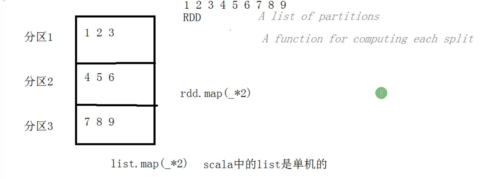
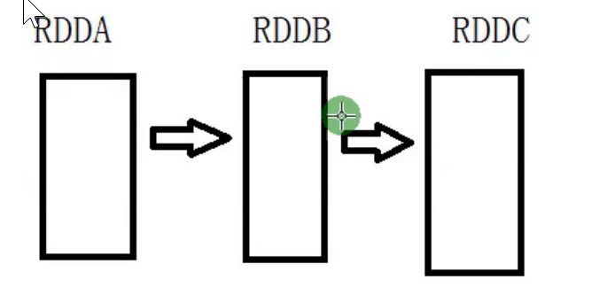
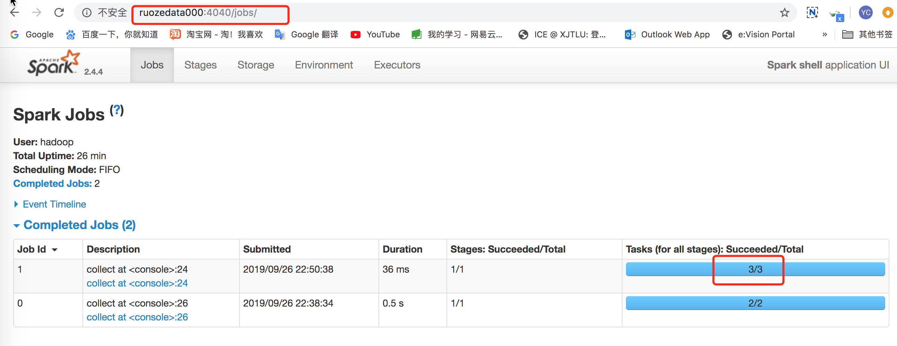
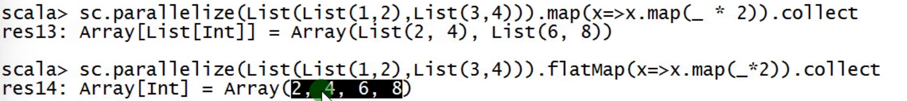
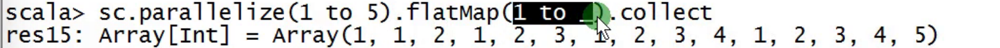
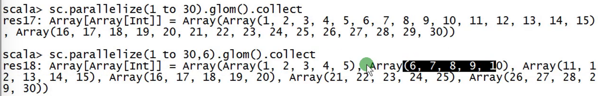
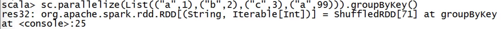
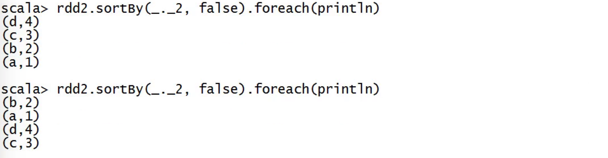
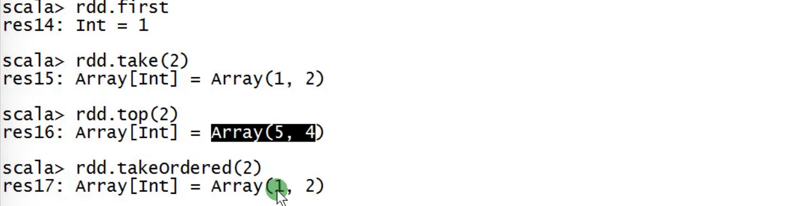

[TOC]

## 1.RDD简介

**RDD** Resilient Distributed Dataset

- 弹性:容错的   spark做分布式计算的时候,可以做到容错.1个作业有10个task,2个挂掉,自动把其他的task在其他的机器上/进程启动.根据rdd的特性做到容错.

- 分布式:多个节点上可以运行


官网RDDs:

```
Spark revolves around the concept of a resilient distributed dataset (RDD), which is a fault-tolerant collection of elements that can be operated on in parallel. There are two ways to create RDDs: parallelizing an existing collection in your driver program, or referencing a dataset in an external storage system, such as a shared filesystem, HDFS, HBase, or any data source offering a Hadoop InputFormat.
```


源码中: RDD.scala

```
* A Resilient Distributed Dataset (RDD), the basic abstraction in Spark. Represents an immutable,
 * partitioned collection of elements that can be operated on in parallel. This class contains the
 * basic operations available on all RDDs, such as `map`, `filter`, and `persist`.In addition,
 * [[org.apache.spark.rdd.PairRDDFunctions]] contains operations available only on RDDs of key-value
 * pairs, such as `groupByKey` and `join`;

* Internally, each RDD is characterized by five main properties:
*
*  - A list of partitions
*  - A function for computing each split
*  - A list of dependencies on other RDDs
*  - Optionally, a Partitioner for key-value RDDs (e.g. to say that the RDD is hash-partitioned)
*  - Optionally, a list of preferred locations to compute each split on (e.g. block locations for
*    an HDFS file)
```


RDD:
    the basic abstraction in Spark  (RDD是spark中最基础的部分,rdd是数据集)
    Represents an immutable,  a==>b==>c  	(a到b到c做了不同的操作  a,b,c是不同的东西)
        partitioned collection of elements (分区的)
            1 2 3 / 4 5 6 / 7 8 9   3(个分区)
        that can be operated on in parallel.   (分区里的东西是以并行的方式运行的)

PairRDDFunctions  <k,v>      键值对的rdd    (内部有隐式转换)


## 2.RDD五大特性

**1.A list of partitions**

假设rdd里是1-9




```scala
protected def getPartitions: Array[Partition]
```


**2.A function for computing each split**

针对RDD做操作其实就是针对RDD底层的partition进行操作

rdd.map(_*2) 的操作:  对一个rdd操作,是对rdd里的所有分区里的元素都做操作.

split理解为分区


rdd.map(_*2)

```scala
def compute(split: Partition, context: TaskContext): Iterator[T]
```


**3.A list of dependencies on other RDDs**




rddc是从rddb里过来的,rddb是从rdda中过来的.c依赖于b


```scala
protected def getDependencies: Seq[Dependency[_]] = deps
```

(宽依赖 窄依赖)


**4.Optionally, a Partitioner for key-value RDDs (e.g. to say that the RDD is hash-partitioned)**

可以指定一个分区器. 只针对key-value而言


```scala
@transient val partitioner: Option[Partitioner] = None
```


**5.a list of preferred locations to compute each split on (e.g. block locations for an HDFS file)**

mr或者大数据框架调度的时候,优先把作业调度到数据所在节点(调度到最佳的位置. 把作业调度到本节点是最理想的.但是万一改节点作业很多,负载很高,就不能调度到该节点) 

为了减少数据的移动.进而减少网络的开销.

数据有可能是在hdfs上,也可能缓存到内存上的. 所以是 locations 


```scala
protected def getPreferredLocations(split: Partition): Seq[String] = Nil
```


## 3.Rdd编程入口

```shell
scala> val rdd = sc.parallelize(List(1,2,3,4,5,6),3).collect()
rdd: Array[Int] = Array(1, 2, 3, 4, 5, 6)
```



- 创建流程

```scala
object RDDApp1 {

  //master url:决定作业运行在什么模式下
  
  def main(args: Array[String]): Unit = {

    //step1:sparkconf 传递spark里的信息
    val sparkConf = new SparkConf().setMaster("local[2]").setAppName("RDDApp1")

    //step2:sparkconf
    val sc = new SparkContext(sparkConf)

    //step3:处理业务逻辑
    val rdd = sc.parallelize(List(1,2,3,4,5,6),3)
    rdd.collect().foreach(println)

    //step4:关闭SparkContext
    sc.stop()
  }
}
```


开发Spark应用程序
    1）SparkConf
        appName
        master
    2）SparkContext(sparkConf)
    3）spark-shell --master local[2] 底层自动为我们创建了SparkContext sc


spark-shell里的一段代码:

```shell
 "${SPARK_HOME}"/bin/spark-submit --class org.apache.spark.repl.Main --name "Spark shell" 
```


## 4.Rdd创建方式

RDD创建方式
    1）parallelize   适用于测试      makeRDD底层还是调用了parallelize  
    2）External Datasets  生产 (通过外面的数据集 本地文件系统 hdfs等)
    3）通过已有RDD转换过来的  生产

 

```
#第一种
scala> val rdd = sc.parallelize(List(1,2,3,4,5))
rdd: org.apache.spark.rdd.RDD[Int] = ParallelCollectionRDD[2] at parallelize at <console>:24

#第二种
scala> val rdd = sc.textFile("file:////home/hadoop/data/wc.data")
rdd: org.apache.spark.rdd.RDD[String] = file:////home/hadoop/data/wc.data MapPartitionsRDD[1] at textFile at <console>:24

scala> val rdd = sc.textFile("file:////home/hadoop/data/wc.data")
res0: Array[String] = Array(ruoze,ruoze,ruoze, jack,jack, star)

#第三种 通过已有的rdd转换成一个新的rdd (用的最多)
scala> val rdd = sc.parallelize(List(1,2,3,4,5))
rdd: org.apache.spark.rdd.RDD[Int] = ParallelCollectionRDD[2] at parallelize at <console>:24

scala> val rdd1 = rdd.map(_*2)
rdd1: org.apache.spark.rdd.RDD[Int] = MapPartitionsRDD[3] at map at <console>:25

scala> rdd1.collect
res1: Array[Int] = Array(2, 4, 6, 8, 10)
```


查看rdd来自哪里

```
scala> rdd1.toDebugString
res2: String =
(2) MapPartitionsRDD[3] at map at <console>:25 []
 |  ParallelCollectionRDD[2] at parallelize at <console>:24 []
```


```
scala> val rdd = sc.parallelize(List(1,2,3,4,5,6),3).collect
rdd: Array[Int] = Array(1, 2, 3, 4, 5, 6)
```

若传进来的东西很多,3这个参数调大些,意味着分区数少一些


## 5.RDD操作

​    1.transformation  转换    它不会立即执行  你写了1亿个转换  白写   lazy

​    2.action          动作    只有遇到action才会提交作业开始执行      eager

```
scala> val rdd = sc.parallelize(List(1,2,3,4,5))
rdd: org.apache.spark.rdd.RDD[Int] = ParallelCollectionRDD[2] at parallelize at <console>:24

scala> val rdd1 = rdd.map(_*2)
rdd1: org.apache.spark.rdd.RDD[Int] = MapPartitionsRDD[4] at map at <console>:25

scala> rdd1.collect()
res2: Array[Int] = Array(2, 4, 6, 8, 10)
```

- 前两步都没有作业,只有到第三步触发action动作,才有作业


### 5.1 map,mapPartitions,mapPartitionsWithIndex

```scala
//step1:sparkconf
val sparkConf = new SparkConf().setMaster("local[2]").setAppName("RDDApp1")

//step2:sparkconf
val sc = new SparkContext(sparkConf)

//step3
val rdd = sc.parallelize(List(1, 2, 3, 4, 5))

/**
  * map 处理每一条数据
  * mapPartitions 对每个分区进行处理
  *
  * map：100个元素  10个分区 ==> 知识点：要把RDD的数据写入MySQL  Connection
  */
rdd.map(_*2).collect().foreach(println)

rdd.mapPartitions(partition => partition.map(_*2)).collect().foreach(println)

rdd.mapPartitionsWithIndex((index, partition) =>{
      partition.map(x => s"分区编号是$index, 元素是$x")
    }).collect().foreach(println)
```

rdd.mapPartitionsWithIndex 结果:

```
分区编号是0, 元素是1
分区编号是0, 元素是2
分区编号是1, 元素是3
分区编号是1, 元素是4
分区编号是1, 元素是5
```

如果val rdd = sc.parallelize(List(1, 2, 3, 4, 5),3) 结果:

```
分区编号是0, 元素是1
分区编号是1, 元素是2
分区编号是1, 元素是3
分区编号是2, 元素是4
分区编号是2, 元素是5
```


mapPartitionsWithIndex生产上一般不用.因为不关注哪个分区.不用关心index.


### 5.2 mapValues

mapValues 是针对RDD[K,V]的V做处理

key不变,只变value

```scala
// mapValues 是针对RDD[K,V]的V做处理,key不变,只变value
scala> sc.parallelize(List(("ruoze",30),("J哥",18))).mapValues(_ + 1).collect
res3: Array[(String, Int)] = Array((ruoze,31), (J哥,19))
```


### 5.3 flatMap

flatmap = map + flatten

```
scala> sc.parallelize(List(List(1,2),List(3,4))).map(x=>x.map(_ * 2)).collect
res4: Array[List[Int]] = Array(List(2, 4), List(6, 8))

scala> sc.parallelize(List(List(1,2),List(3,4))).flatMap(x=>x.map(_*2)).collect
res5: Array[Int] = Array(2, 4, 6, 8)
```


- flatMap 和 map 的区别

[flatMap和map的区别](https://www.4spaces.org/spark-map-flatmap/)

```
a b c

d
```

```
val textFile = sc.textFile("README.md")
textFile.flatMap(_.split(" ")) 
```

其实就是经历了以下转换

```
["a b c", "", "d"] => [["a","b","c"],[],["d"]] => ["a","b","c","d"]
```

在这个示例中，flatMap就把包含多行数据的RDD，即`[“a b c”, “”, “d”]` ，转换为了一个包含多个单词的集合。实际上，flatMap相对于map多了的是`[[“a”,”b”,”c”],[],[“d”]] => [“a”,”b”,”c”,”d”]`这一步。

- 对比:

map(func)函数会对每一条输入进行指定的func操作，然后为每一条输入返回一个对象；而flatMap(func)也会对每一条输入进行执行的func操作，然后每一条输入返回一个相对，但是最后会将所有的对象再合成为一个对象；从返回的结果的数量上来讲，**map**返回的数据对象的个数和原来的输入数据是**相同**的，而**flatMap**返回的个数则是**不同**的。

---







分区:(默认两个分区)




### 5.4 others

union 两个rdd简单的合并

intersection  做交集

subtract 做差集 出现在a,但没出现在b


### 5.5 mapPartitionsWithIndex

```scala
rdd.distinct(4).mapPartitionsWithIndex((index,partition)=>{
      partition.map(x => s"分区是$index,元素是$x")
})
```

- 分区规则:

4个分区  元素%partitions (取模)

分区是0,元素是4, 4%4=0
分区是0,元素是8, 8%4=0
分区是1,元素是5, 5%4=1
分区是2,元素是6, 6%4=2
分区是3,元素是3, 3%4=3
分区是3,元素是7，7%4=3


### 5.6 groupByKey(不怎么用)

作用在rdd上面.有key有v.没有要造一个

是对每个 key 进行操作，但只生成一个 sequence。

 

```
scala> sc.parallelize(List(("a",1),("b",2),("c",3),("a",99))).groupByKey().collect
res15: Array[(String, Iterable[Int])] = Array((b,CompactBuffer(2)), (a,CompactBuffer(1, 99)), (c,CompactBuffer(3)))

scala> sc.parallelize(List(("a",1),("b",2),("c",3),("a",99))).groupByKey().mapValues(_.sum).collect()
res17: Array[(String, Int)] = Array((b,2), (a,100), (c,3))
```


### 5.7 reduceByKey

在一个(K,V)的 RDD 上调用，返回一个(K,V)的 RDD，使用指定的 reduce 函数，将相同 key 的值聚合到一起，reduce 任务的个数可以通过第二个可选的参数来设置。


reduceByKey的作用对像是(key, value)形式的rdd，而reduce有减少、压缩之意，reduceByKey的作用就是对相同key的数据进行处理，最终每个key只保留一条记录。

```
scala> sc.parallelize(List(("a",1),("b",2),("c",3),("a",99))).reduceByKey((x,y) => x+y).collect

scala> sc.parallelize(List(("a",1),("b",2),("c",3),("a",99))).reduceByKey(_+_).collect
res19: Array[(String, Int)] = Array((b,2), (a,100), (c,3))
```

reduceByKey会寻找相同key的数据，当找到这样的两条记录时会对其value(分别记为x,y)做`(x,y) => x+y`的处理，即只保留求和之后的数据作为value。反复执行这个操作直至每个key只留下一条记录。


### 5.8 去重(思路要掌握)

```scala
/**
  * distinct 去重
  * 不允许使用distinct做去重
  *
  * x => (x,null)
  *
  * 8 => (8,null)
  * 8 => (8,null)
  */
  
	val b = sc.parallelize(List(3,4,5,6,7,8,8))
```


```
scala> val b = sc.parallelize(List(3,4,5,6,7,8,8))
b: org.apache.spark.rdd.RDD[Int] = ParallelCollectionRDD[19] at parallelize at <console>:24

#reduceByKey 把相同的东西放一块
#(x,y) 两个相邻的取一个
scala> b.map(x => (x,null)).reduceByKey((x,y) => x).map(_._1).collect
res20: Array[Int] = Array(4, 6, 8, 3, 7, 5)
```


### 5.9 groupBy

自定义分组  分组条件就是自定义传进去的

```
scala> sc.parallelize(List("a","a","a","b","b","c")).groupBy(x=>x).collect
res26: Array[(String, Iterable[String])] = Array((b,CompactBuffer(b, b)), (a,CompactBuffer(a, a, a)), (c,CompactBuffer(c)))

#算每个单词出现的次数
scala> sc.parallelize(List("a","a","a","b","b","c")).groupBy(x=>x).mapValues(x=>x.size)
res24: org.apache.spark.rdd.RDD[(String, Int)] = MapPartitionsRDD[29] at mapValues at <console>:25

scala> sc.parallelize(List("a","a","a","b","b","c")).groupBy(x=>x).mapValues(x=>x.size).collect
res25: Array[(String, Int)] = Array((b,2), (a,3), (c,1))
```


### 5.10 sortBy

```
scala> sc.parallelize(List(("ruoze",30),("J哥",18),("星星",60))).sortBy(_._2).collect
res32: Array[(String, Int)] = Array((J哥,18), (ruoze,30), (星星,60))

#降序
scala> sc.parallelize(List(("ruoze",30),("J哥",18),("星星",60))).sortBy(_._2,false).collect
res33: Array[(String, Int)] = Array((星星,60), (ruoze,30), (J哥,18))

scala> sc.parallelize(List(("ruoze",30),("J哥",18),("星星",60))).sortBy(-_._2).collect
res33: Array[(String, Int)] = Array((星星,60), (ruoze,30), (J哥,18))
```


```
 val rdd2 = sc.parallelize(List(("a",1),("b",2),("c",3),("d",4)),2)
 rdd2.sortBy(_._2, false).foreach(println)
```

- 是全局排序



```
rdd2.sortBy(_._2, false).saveAsTextFile("out")
```


foreach根本看不到是否是全局排序.因为foreach不确定是哪个task先打印出来.


结果不一样,不确定哪个分区先打印出来

- rdd.top  red.takeOrdered




### 

### 5.11 sortByKey

sortBy 比 sortByKey 更灵活

sortBy底层调用的是sortByKey

```
scala> sc.parallelize(List(("ruoze",30),("J哥",18),("星星",60))).map(x=>(x._2,x._1)).sortByKey().collect
res35: Array[(Int, String)] = Array((18,J哥), (30,ruoze), (60,星星))

scala> sc.parallelize(List(("ruoze",30),("J哥",18),("星星",60))).map(x=>(x._2,x._1)).sortByKey().map(x=>(x._2,x._1)).collect
res37: Array[(String, Int)] = Array((J哥,18), (ruoze,30), (星星,60))
```

### 5.12 join

```
/**
  * join底层就是使用了cogroup
  * RDD[K,V]
  *
  * 根据key进行关联，返回两边RDD的记录，没关联上的是空
  * join返回值类型  RDD[(K, (Option[V], Option[W]))]
  * cogroup返回值类型  RDD[(K, (Iterable[V], Iterable[W]))]
  */
```


```
scala> val a = sc.parallelize(List(("若泽", "北京"), ("J哥", "上海"), ("仓老师", "杭州")))
a: org.apache.spark.rdd.RDD[(String, String)] = ParallelCollectionRDD[83] at parallelize at <console>:24

scala> val c = sc.parallelize(List(("若泽", "30"), ("J哥", "18"), ("星星", "60")))
c: org.apache.spark.rdd.RDD[(String, String)] = ParallelCollectionRDD[84] at parallelize at <console>:24

scala>  a.join(c).collect()
res38: Array[(String, (String, String))] = Array((若泽,(北京,30)), (J哥,(上海,18)))

scala> a.leftOuterJoin(c).collect()
res40: Array[(String, (String, Option[String]))] = Array((若泽,(北京,Some(30))), (仓老师,(杭州,None)), (J哥,(上海,Some(18))))

```

**fullOuterJoin**

```
val value: RDD[(String, (Option[String], Option[String]))] = a.fullOuterJoin(c)

scala> a.fullOuterJoin(c).collect
res42: Array[(String, (Option[String], Option[String]))] = Array((星星,(None,Some(60))), (若泽,(Some(北京),Some(30))), (仓老师,(Some(杭州),None)), (J哥,(Some(上海),Some(18))))
```

**cogroup **    join底层就是使用了cogroup

```
val value2: RDD[(String, (Iterable[String], Iterable[String]))] = a.cogroup(c)

scala> a.cogroup(c).collect
res41: Array[(String, (Iterable[String], Iterable[String]))] = Array((星星,(CompactBuffer(),CompactBuffer(60))), (若泽,(CompactBuffer(北京),CompactBuffer(30))), (仓老师,(CompactBuffer(杭州),CompactBuffer())), (J哥,(CompactBuffer(上海),CompactBuffer(18))))
```

