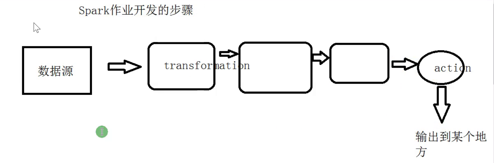
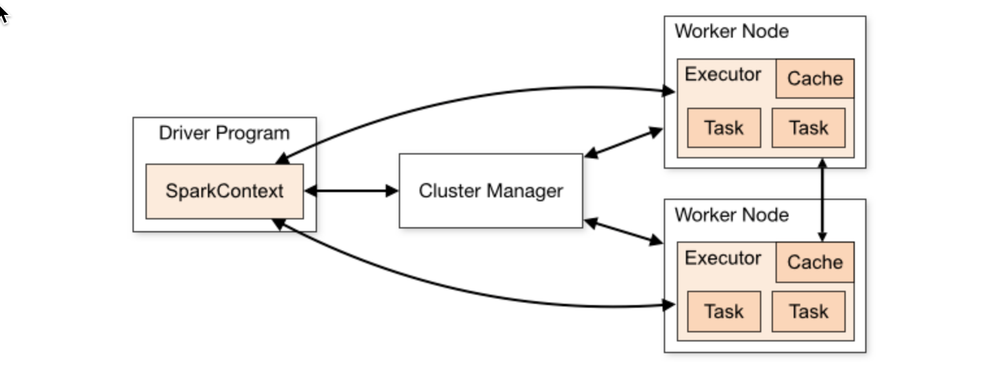
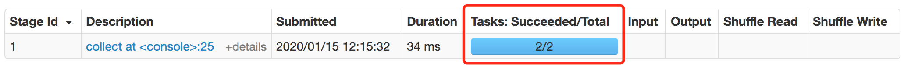
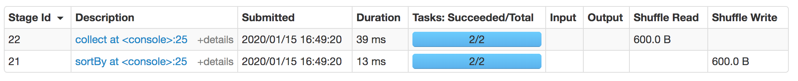

[TOC]

## 1.spark编程的流程



## 2.Action算子 

如何判断transformation还是action?

 代码底层有无**runJob**

### 2.1 collect

```
/**
 * Return an array that contains all of the elements in this RDD.
 *
 * @note This method should only be used if the resulting array is expected to be small, as
 * all the data is loaded into the driver's memory.
 */
```

在生产一般不用


```
scala> val rdd = sc.parallelize(List(1,2,3,4,5))
rdd: org.apache.spark.rdd.RDD[Int] = ParallelCollectionRDD[99] at parallelize at <console>:24

scala> rdd.collect
res43: Array[Int] = Array(1, 2, 3, 4, 5)
```

rdd返回 all of the elements.万一有一亿条数据,肯定oom.

 真正生产上使用collect只有一个地方：


### 2.2 foreach

```
scala> rdd.foreach(println)
1
2
3
4
5
```

foreach根本看不到是否是全局排序.因为foreach不确定是哪个task先打印出来.

### 2.3 count

返回元素的个数

```
scala> rdd.count
res48: Long = 5
```

### 2.4 reduce

两两做一个操作

```
scala> rdd.reduce(_+_)
res49: Int = 15
```

### 2.5 first

取第一个,底层调用的是take(1)

```
scala> rdd.first
res50: Int = 1
```

### 2.6 take

取多个

```
scala> rdd.take(2)
res52: Array[Int] = Array(1, 2)
```

### 2.7 top

```
scala> rdd.top(2) 
res53: Array[Int] = Array(5, 4)
```


底层调用的是takeOrdered方法

源码:

```scala
def top(num: Int)(implicit ord: Ordering[T]): Array[T] = withScope {
  takeOrdered(num)(ord.reverse)
}
```

### 2.8 takeOrdered

```
scala> rdd.takeOrdered(2)
res54: Array[Int] = Array(1, 2)
```


### 2.9 zipWithIndex

把无k v的结构转换成k v结构

```
scala> rdd.zipWithIndex().collect
res56: Array[(Int, Long)] = Array((1,0), (2,1), (3,2), (4,3), (5,4))
```

**countByKey**是action.因为底层有用collect

```
scala> rdd.zipWithIndex().countByKey()
res67: scala.collection.Map[Int,Long] = Map(5 -> 1, 1 -> 1, 2 -> 1, 3 -> 1, 4 -> 1)
```

collectAsMap

```
scala> rdd.zipWithIndex().collectAsMap()
res68: scala.collection.Map[Int,Long] = Map(2 -> 1, 5 -> 4, 4 -> 3, 1 -> 0, 3 -> 2)
```


## 3. Sort

### **第一种**写法:

```scala
package com.ruozedata.bigdata.spark.core02

import org.apache.spark.{SparkConf, SparkContext}

object test {
  def main(args: Array[String]): Unit = {
    //step1:sparkconf
    val sparkConf = new SparkConf().setMaster("local[2]").setAppName("RDDApp1")

    //step2:sparkconf
    val sc = new SparkContext(sparkConf)

    //名称 价格 库存
    val products = sc.parallelize(List("皮鞭 20 10","蜡烛 20 100","扑克牌 5 2000","iphone11 7000 1000"))
        products.map(x => {
          val splits = x.split(" ")
          val name = splits(0)
          val price = splits(1).toDouble
          val amount = splits(2).toInt

          (name, price, amount)
        }).sortBy(x => (-x._2, -x._3)).collect().foreach(println)
  }
}
```

结果:

```
(iphone11,7000.0,1000)
(蜡烛,20.0,100)
(皮鞭,20.0,10)
(扑克牌,5.0,2000)
```


### **第二种**写法:

```scala
class Products(val name:String, val price:Double,val amount:Int)
  extends Ordered[Products] with Serializable {
  override def compare(that: Products): Int = {
    this.amount - that.amount
  }

  override def toString: String = name + "\t" + price + "\t" + amount
}
```

```scala
object SortApp02 {

  def main(args: Array[String]): Unit = {
    //step1:sparkconf
    val sparkConf = new SparkConf().setMaster("local[2]").setAppName("RDDApp1")

    //step2:sparkconf
    val sc = new SparkContext(sparkConf)

    val products = sc.parallelize(List("皮鞭 20 10","蜡烛 20 100","扑克牌 5 2000","iphone11 7000 1000"))
    products.map(x => {
      val splits = x.split(" ")
      val name = splits(0)
      val price = splits(1).toDouble
      val amount = splits(2).toInt
      new Products(name,price,amount)
//      Products2(name,price,amount)

    }).sortBy(x => x).collect().foreach(println)
    sc.stop()
  }
}
```

工作中一般不这么写,因为要实现序列化.有点麻烦


### **第三种**写法:

使用**case class**

case class 重写了toString， equals hashCode
case class 默认就实现了序列化
case class 不用new

```scala
case class Products2(name:String,price:Double,amount:Int)
  extends Ordered[Products2]{
  override def compare(that: Products2): Int = {
    this.amount - that.amount
  }
}
```

```scala
object SortApp02 {

  def main(args: Array[String]): Unit = {
    //step1:sparkconf
    val sparkConf = new SparkConf().setMaster("local[2]").setAppName("RDDApp1")

    //step2:sparkconf
    val sc = new SparkContext(sparkConf)

    val products = sc.parallelize(List("皮鞭 20 10", "蜡烛 20 100", "扑克牌 5 2000", "iphone11 7000 1000"))
    products.map(x => {
      val splits = x.split(" ")
      val name = splits(0)
      val price = splits(1).toDouble
      val amount = splits(2).toInt
      //      new Products(name,price,amount)
      Products2(name, price, amount)

    }).sortBy(x => x).collect().foreach(println)
    sc.stop()
  }
}
```


### **第四种**写法:

需求:不允许在类上做任何修改 实现排序功能.

视频52min


---

## 4.核心术语

link: [spark](http://spark.apache.org/docs/latest/cluster-overview.html)




核心术语:

​    **Application** (五星)
​        a driver program       driver最好离executor近一些
​        executors on the cluster. 

​    **Application jar**

​    **Driver program**  (五星)   在main方法可以创建sc
​        main
​        sc

​    **Cluster manager**

​    **Deploy mode**       区分driver跑在哪里
​        YARN: RM NM(container)
​            cluster: Driver是跑在container(跑在集群内的)
​            client：Driver就运行在你提交机器的本地
​                client是不是一定要是集群内的？不一定 gateway

​    **Worker node**  集群上的nm(yarn上)

​    **Executor**  \(五星) 				相当于yarn的container
​        process 			一个进程
​        runs tasks  		运行task是在Executor里的
​        keeps data in memory or disk storage across them    缓存数据
​        Each application has its own executors.
​            A(应用程序)：executor1 2 3
​            B(应用程序)：executor1 2 3

​    **Task**	(五星)
​        A unit of work that will be sent to one executor   (线程级别的)

​				发过去的东西是task(圆圈代表executor)


​        RDD: partitions == task

​				RDD由多个partition组成,每个partition对应一个task




​    **Job**    (五星)
​        action ==> job (只要遇到action就会产生job,transformation不会产生job)

​    **Stage**

​		一个job由多个stage所构成.

​		stage遇到**shuffle**算子就会拆




<font color="red">spark-shell  应用程序</font>
<font color="red">一个application：1到n个job</font>
<font color="red">一个job ： 1到n个stage构成</font>
<font color="red">一个stage： 1到n个task  task与partition一一对应</font>


Alluxio -- 分布式基于内存的框架,可以兼容spark等.不同应用程序间可以做到共享