[TOC]


## 1.依赖关系
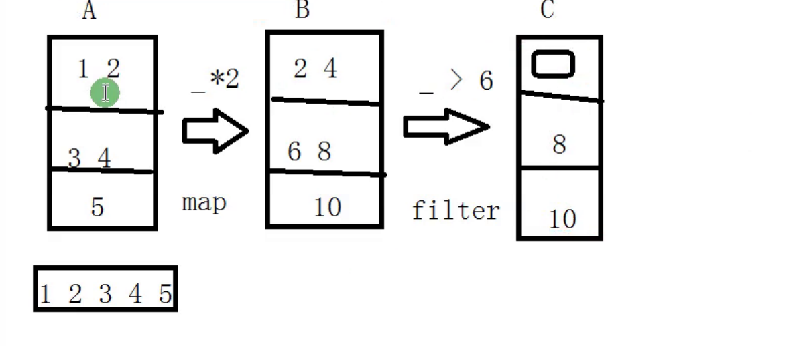

A,B,C之间是有一个依赖关系的.


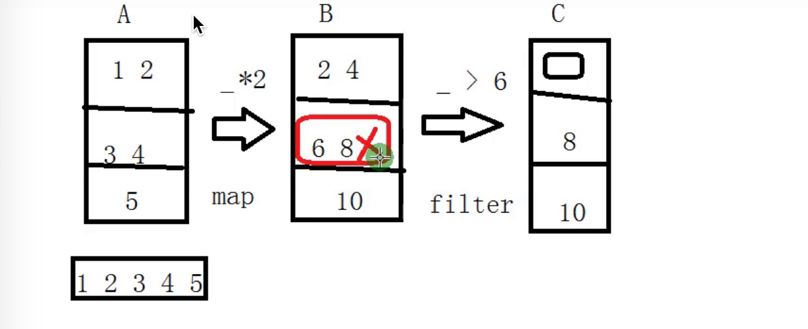

红色的分区出错时,重新计算时,只需要算这一个分区即可.这个分区的数据是从 上个分区的数据来的.

(6,8)的数据到底是从哪个分区过来的.存在依赖关系.


lineage: 

一个rdd是如何从父rdd计算得来.

性能快

容错.


## 2. compute chain 


**依赖:**

```
scala> val a = sc.parallelize(List(1,2,3,4,5))
a: org.apache.spark.rdd.RDD[Int] = ParallelCollectionRDD[0] at parallelize at <console>:24

scala> val b = a.map(_*2)
b: org.apache.spark.rdd.RDD[Int] = MapPartitionsRDD[1] at map at <console>:25

scala> val c = b.filter(_>6)
c: org.apache.spark.rdd.RDD[Int] = MapPartitionsRDD[2] at filter at <console>:25

scala> c.collect
res0: Array[Int] = Array(8, 10)
```

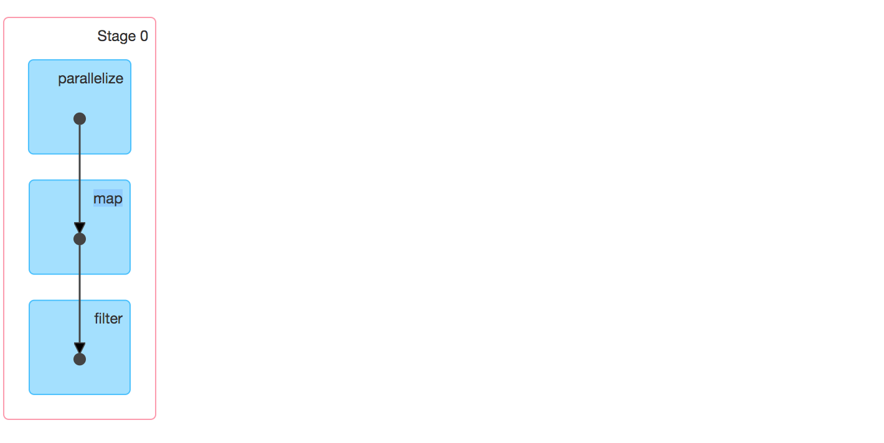

有几个rdd:(产生了三个rdd)

### toDebugString

```
scala> c.toDebugString
res3: String =
(2) MapPartitionsRDD[2] at filter at <console>:25 []
 |  MapPartitionsRDD[1] at map at <console>:25 []
 |  ParallelCollectionRDD[0] at parallelize at <console>:24 []
```


TextInputFormat
mapper: LongWritable（每行数据的偏移量）  Text(每行数据的内容)

hadoopFile(path, classOf[TextInputFormat],
        classOf[LongWritable],
        classOf[Text],
      minPartitions)
==> mapper (相当于mr中mapper做的事情)

对离线来说,不关心每行数据的偏移量,关心的是每行数据的内容

(1,xxxx)
(5,yyyy)

.map(pair => pair._2.toString)    xxxx   yyyy 	(真正拿到的是每行文本的内容)


textFile包含的rdd:
    HadoopRDD
    MapPartitionsRDD
flatMap
    MapPartitionsRDD
map
    MapPartitionsRDD
reduceByKey
    ShuffledRDD


## 3.Dependency

可以查看源码 Dependency

 

  ### 3.1窄依赖
​        一个父RDD的partition至多被子RDD的partition使用一次

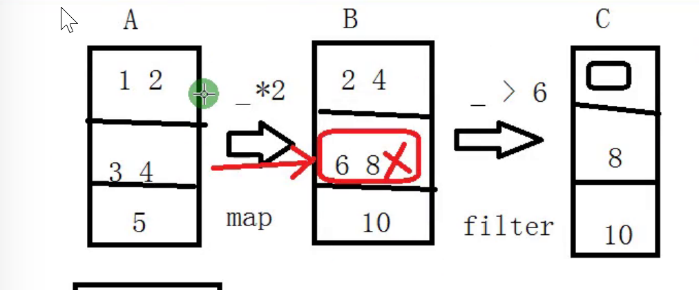


​	map和filter是典型的窄依赖


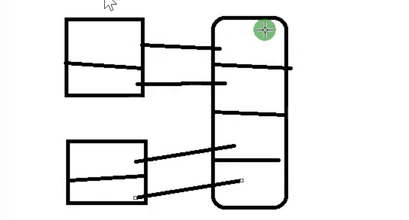

​			union也是窄依赖


​        OneToOneDependency  是 窄依赖
​        **都在一个stage中完成**

### 3.2 宽依赖   
 必然 会产生shuffle **会有新的stage**

​        一个父RDD的partition会被子RDD的partition使用多次


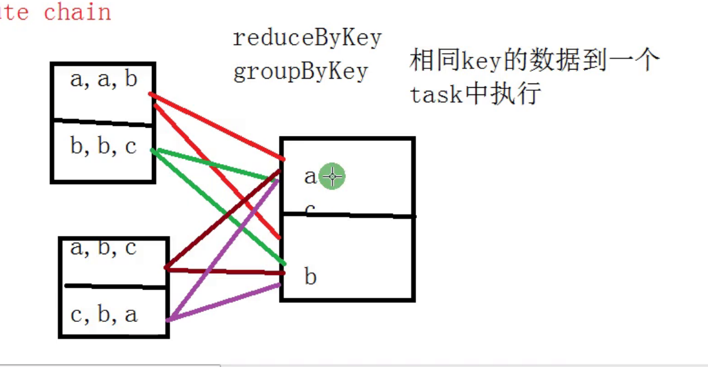


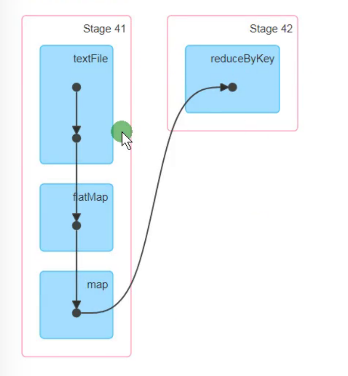


在开发过程中,能使用窄依赖就使用窄依赖(95%场景适用)


## 3.word count

```scala
    val lines = sc.textFile("file:///home/hadoop/data/wc.data")
    val words = lines.flatMap(_.split("\t"))
    val pair = words.map((_, 1))
    val result = pair.reduceByKey(_ + _)
    result.collect()
```

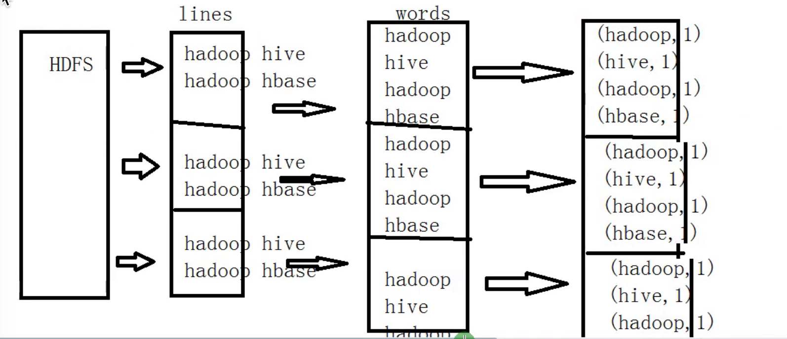

​	combine操作 减少网络开销


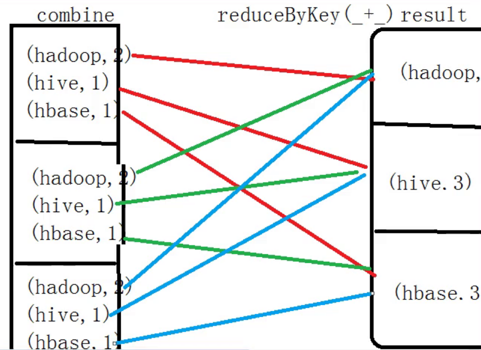


由于遇到了reduceByKey宽依赖的算子.整个流程一分为二.前半部分是stage0.后半部分stage1


reduceByKey是有map端预聚合功能的.  reduce效率会更高一些.

groupByKey是全数据shuffle.没有预聚合功能.


## 4. shuffle

http://spark.apache.org/docs/latest/rdd-programming-guide.html#shuffle-operations


Certain operations within Spark trigger an event known as the shuffle. The shuffle is Spark’s mechanism for re-distributing data so that it’s grouped differently across partitions. This typically involves copying data across executors and machines, making the shuffle a complex and costly operation.


**面试:**

The **Shuffle** is an expensive operation since it involves disk I/O, data serialization, and network I/O. 


## 5.缓存 Cache  Persist

cache
    ==> persist
        ==> persist(MEMORY_ONLY)

```
scala>     sc.textFile("file:///home/hadoop/data/wc.data").flatMap(_.split("\t")).map((_,1))
res4: org.apache.spark.rdd.RDD[(String, Int)] = MapPartitionsRDD[6] at map at <console>:25

scala>     sc.textFile("file:///home/hadoop/data/wc.data").flatMap(_.split("\t")).map((_,1)).collect
res5: Array[(String, Int)] = Array((ruoze,ruoze,ruoze,1), (jack,jack,1), (star,1))
```

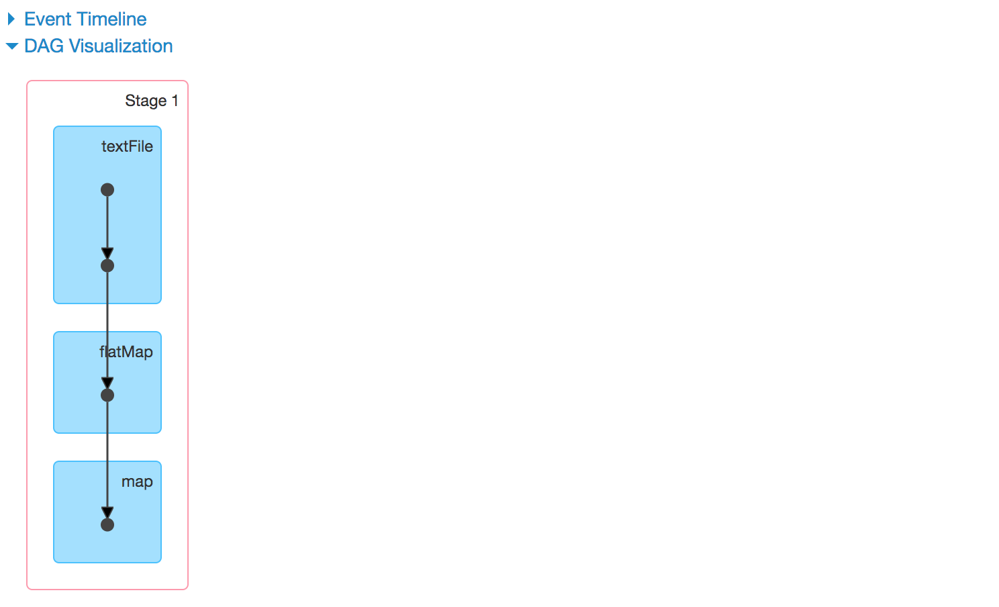

对一个动作重复多次,每次都从源头开始操作.

建议先缓存起来.缓存的数据存在executor中.


**面试:**

spark中有两个算子实现cache

```scala
pair.cache()  // lazy 要action才能执行
pair.persist(StorageLevel.MEMORY_ONLY_SER)  // lazy
pair.unpersist() //eager
```

You can mark an RDD to be persisted using the `persist()` or `cache()` methods on it. The first time it is computed in an action, it will be kept in memory on the nodes. 


rdd1就会在第一次执行的时候被持久化到内存中,后面的业务代码就可以复用,能有效提高效率

其中cache这个方法也是个Tranformation,当第一次遇到Action算子的时才会进行持久化

其中cache内部调用了persist方法,persist方法又调用了persist(StorageLevel.MEMORY_ONLY)方法,所以执行cache算子其实就是执行了persist算子且持久化级别为MEMORY_ONLY


cache
    ==> persist
        ==> persist(MEMORY_ONLY)


MEMORY_ONLY = new StorageLevel(false, true, false, true) 				默认的
MEMORY_ONLY_SER = new StorageLevel(false, true, false, false)


class StorageLevel private(
    private var _useDisk: Boolean,
    private var _useMemory: Boolean,
    private var _useOffHeap: Boolean,
    private var _deserialized: Boolean,
    private var _replication: Int = 1)


### repartition

```scala
object CoalesceAndRepartitionApp {
  def main(args: Array[String]): Unit = {
//    val sc = ContextUtils.getSparkContext(this.getClass.getSimpleName)

    //step1:sparkconf
    val sparkConf = new SparkConf().setMaster("local[2]").setAppName("RDDApp1")
    //如果是生产 不需要写后面的,就写val sparkConf = new SparkConf()

    //step2:sparkconf
    val sc = new SparkContext(sparkConf)

    val data = sc.parallelize(List(1 to 9: _*),3)

    data.mapPartitionsWithIndex((index,partition) => {
      partition.map(x=>s"分区是$index,元素是$x")
    }).collect().foreach(println)

    val repartitionRDD = data.repartition(4)
    repartitionRDD.mapPartitionsWithIndex((index,partition) => {
      partition.map(x=>s"分区是$index,元素是$x")
    }).collect().foreach(println)

    data.coalesce(2)
    sc.stop()
  }
}
```

repartition底层是有shuffle的.


Operations which can cause a shuffle include **repartition** operations like [`repartition`](http://spark.apache.org/docs/latest/rdd-programming-guide.html#RepartitionLink) and [`coalesce`](http://spark.apache.org/docs/latest/rdd-programming-guide.html#CoalesceLink), **‘ByKey** operations (except for counting) like [`groupByKey`](http://spark.apache.org/docs/latest/rdd-programming-guide.html#GroupByLink) and [`reduceByKey`](http://spark.apache.org/docs/latest/rdd-programming-guide.html#ReduceByLink), and **join** operations like [`cogroup`](http://spark.apache.org/docs/latest/rdd-programming-guide.html#CogroupLink) and [`join`](http://spark.apache.org/docs/latest/rdd-programming-guide.html#JoinLink).


### **coalesce**

这个是窄依赖

底层没有shuffle


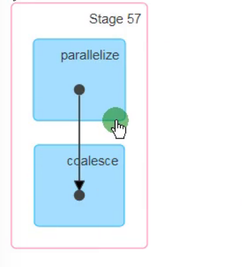


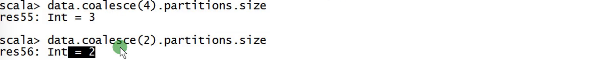

coalesce指定的分区数大于原来的(默认3个),分区的数据不会改变.

变小正常


但也可以放大,要加参数true.但会产生新的shuffle.

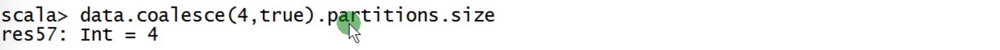

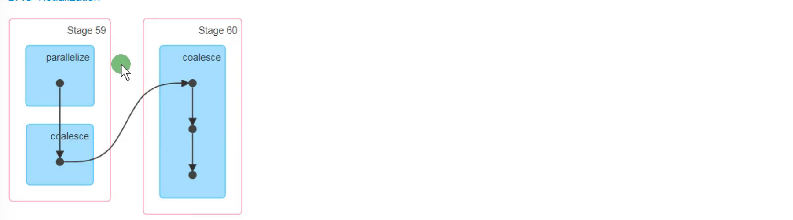


**repartition调用的是coalesce算子，shuffle默认为true   stage**
**coalesce  shuffle默认为false 传shuffle为true，就和repartition**


Q:cogroup和join一定会产生shuffle么?